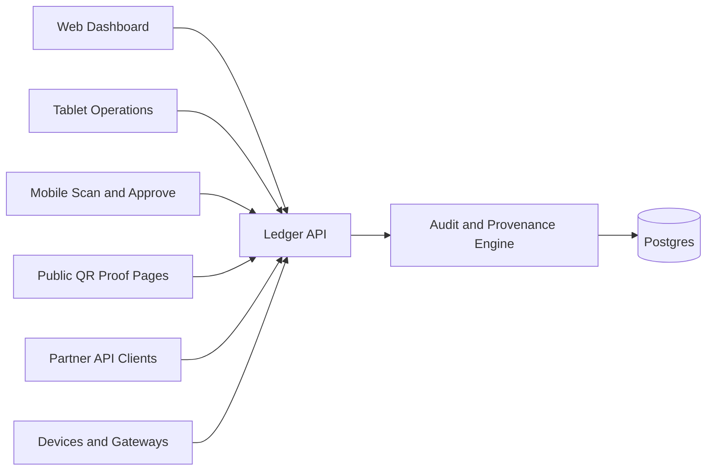

# True North Ledger

True North Ledger is an API-first audit and provenance platform for human workflows, business integrations, and secure device ingestion.

The product goal is simple: every actor has an identity, and every meaningful action becomes an auditable ledger event.

## Current Workspace

This repository is an Nx workspace using pnpm.

Implemented now:

- `apps/ledger-web` - Angular web application with routing, SCSS, Vitest, and Playwright
- `apps/ledger-web-e2e` - Playwright e2e project with 14 quality gates
- `apps/ledger-api` - NestJS REST API with ledger events module (100% test coverage)
- `libs/shared-models` - Unified contract library exports
- `libs/ledger-contracts` - Core Zod schemas for ledger events and metadata
- `libs/auth-contracts` - Actor type and permission schemas  
- `libs/device-contracts` - Device ledger event schemas
- `libs/audit-contracts` - Audit metadata schemas

**Test Coverage:**
- Backend: 100% statements, 100% functions, 80.5% branches, 21 tests
- Frontend: 3 tests with Observable patterns
- E2E: 14 Playwright quality gates

**Architecture:**
- Schema-driven contracts with Zod validation across frontend and API
- Observable-based reactive patterns (RxJS) for all async operations
- In-memory event storage (Postgres persistence next)
- SHA-256 payload hash verification

Planned platform parts:
- Docker Compose infrastructure for Postgres, Redis, API, web, observability, and reverse proxy.
- Device gateway and MQTT broker when real IoT volume requires them.

## Platform Shape



## Core Principles

- Postgres is the system of record.
- NestJS writes and validates truth.
- Angular visualizes and operates on truth.
- Every write creates a ledger event.
- Users, services, devices, and system jobs all have auditable identities.
- WebSockets notify clients; they are not the source of truth.
- MQTT is a later ingestion option, not an MVP dependency.

## Getting Started

Install dependencies:

```sh
pnpm install
```

List projects:

```sh
pnpm nx show projects
```

Run the web app:

```sh
pnpm nx serve ledger-web
```

Build:

```sh
pnpm nx build ledger-web
```

Test:

```sh
pnpm nx test ledger-web
pnpm nx e2e ledger-web-e2e
```

## Documentation

- [Documentation Index](documentation/README.md)
- [Project Overview](documentation/overview/project-overview.md)
- [Architecture](documentation/architecture/architecture.md)
- [Applications](documentation/operations/applications.md)
- [API Design](documentation/platform/api-design.md)
- [Auditability Plan](documentation/platform/auditability-plan.md)
- [Ledger Model](documentation/platform/ledger-model.md)
- [Device Ingestion](documentation/platform/device-ingestion.md)
- [Security Model](documentation/platform/security-model.md)
- [Data Model](documentation/architecture/data-model.md)
- [Infrastructure](documentation/operations/infrastructure.md)
- [Development Workflow](documentation/development/development-workflow.md)
- [Testing and Quality Gates](documentation/development/testing-quality-gates.md)

## Near-Term Build Order

1. ✅ Keep `ledger-web` as the primary adaptive Angular app.
2. ✅ Generate `ledger-api` with `@nx/nest`.
3. ✅ Add shared contract libraries for auth, ledger, audit, and devices.
4. **→ NEXT: Add append-only ledger event persistence (Postgres).**
5. Add device registry and heartbeat endpoints.
6. Add public proof lookup pages.
7. Add Docker Compose services for Postgres, Redis, API, web, and observability.

## Known Issues

### RxJS TypeScript Deprecation Warnings

You may see TypeScript deprecation warnings from RxJS v7.8.2 in VS Code:

```
Option 'moduleResolution=node10' is deprecated...
Option 'baseUrl' is deprecated...
```

**These are benign warnings from the RxJS library's own `tsconfig.json` in `node_modules`.** They:
- ✅ Do not affect builds, tests, or runtime
- ✅ Are not errors in your code
- ✅ Cannot be fixed by modifying workspace configuration
- ✅ Will be resolved when RxJS releases an updated version

All builds and tests pass successfully despite these informational warnings.
