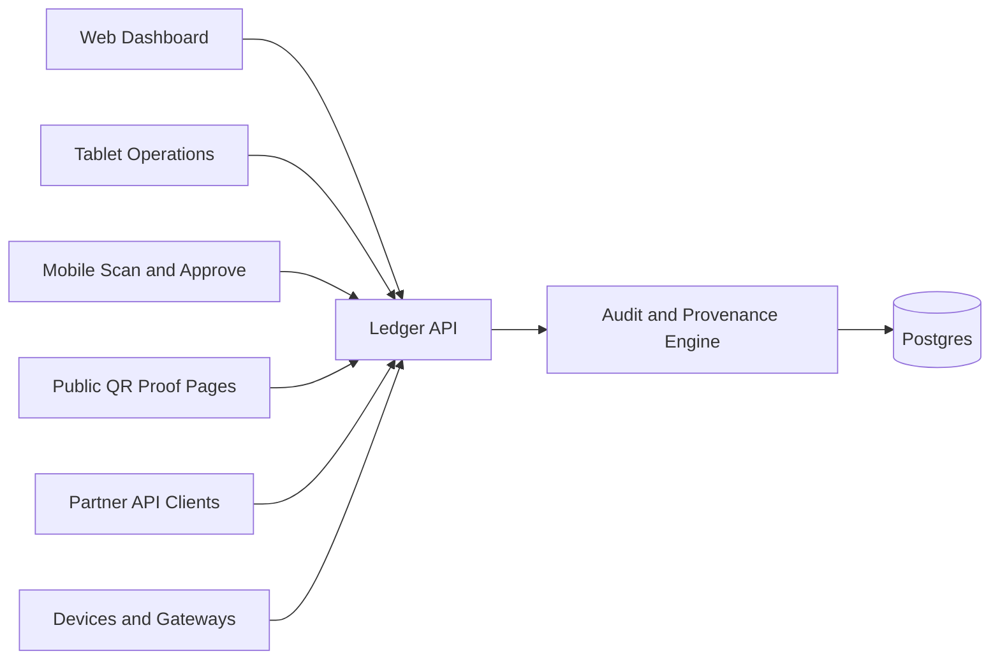

# True North Ledger

True North Ledger is an API-first audit and provenance platform for human workflows, business integrations, and secure device ingestion.

The product goal is simple: every actor has an identity, and every meaningful action becomes an auditable ledger event.

## Current Workspace

This repository is an Nx workspace using pnpm.

Implemented now:

- `apps/ledger-web` - Angular web application, generated with routing, SCSS, Vitest, and Playwright.
- `apps/ledger-web-e2e` - Playwright e2e project for `ledger-web`.

Planned platform parts:

- `ledger-api` - NestJS API for auth, orders, inventory, donations, devices, proofs, and ledger events.
- Shared contract libraries for ledger, auth, device, and audit models.
- Docker Compose infrastructure for Postgres, Redis, API, web, observability, and reverse proxy.
- Device gateway and MQTT broker when real IoT volume requires them.

## Platform Shape



## Core Principles

- Postgres is the system of record.
- NestJS writes and validates truth.
- Angular visualizes and operates on truth.
- Every write creates a ledger event.
- Users, services, devices, and system jobs all have auditable identities.
- WebSockets notify clients; they are not the source of truth.
- MQTT is a later ingestion option, not an MVP dependency.

## Getting Started

Install dependencies:

```sh
pnpm install
```

List projects:

```sh
pnpm nx show projects
```

Run the web app:

```sh
pnpm nx serve ledger-web
```

Build:

```sh
pnpm nx build ledger-web
```

Test:

```sh
pnpm nx test ledger-web
pnpm nx e2e ledger-web-e2e
```

## Documentation

- [Documentation Index](documentation/README.md)
- [Project Overview](documentation/overview/project-overview.md)
- [Architecture](documentation/architecture/architecture.md)
- [Applications](documentation/operations/applications.md)
- [API Design](documentation/platform/api-design.md)
- [Auditability Plan](documentation/platform/auditability-plan.md)
- [Ledger Model](documentation/platform/ledger-model.md)
- [Device Ingestion](documentation/platform/device-ingestion.md)
- [Security Model](documentation/platform/security-model.md)
- [Data Model](documentation/architecture/data-model.md)
- [Infrastructure](documentation/operations/infrastructure.md)
- [Development Workflow](documentation/development/development-workflow.md)
- [Testing and Quality Gates](documentation/development/testing-quality-gates.md)

## Near-Term Build Order

1. Keep `ledger-web` as the primary adaptive Angular app.
2. Generate `ledger-api` with `@nx/nest`.
3. Add shared contract libraries for auth, ledger, audit, and devices.
4. Add append-only ledger event persistence.
5. Add device registry and heartbeat endpoints.
6. Add public proof lookup pages.
7. Add Docker Compose services for Postgres, Redis, API, web, and observability.
