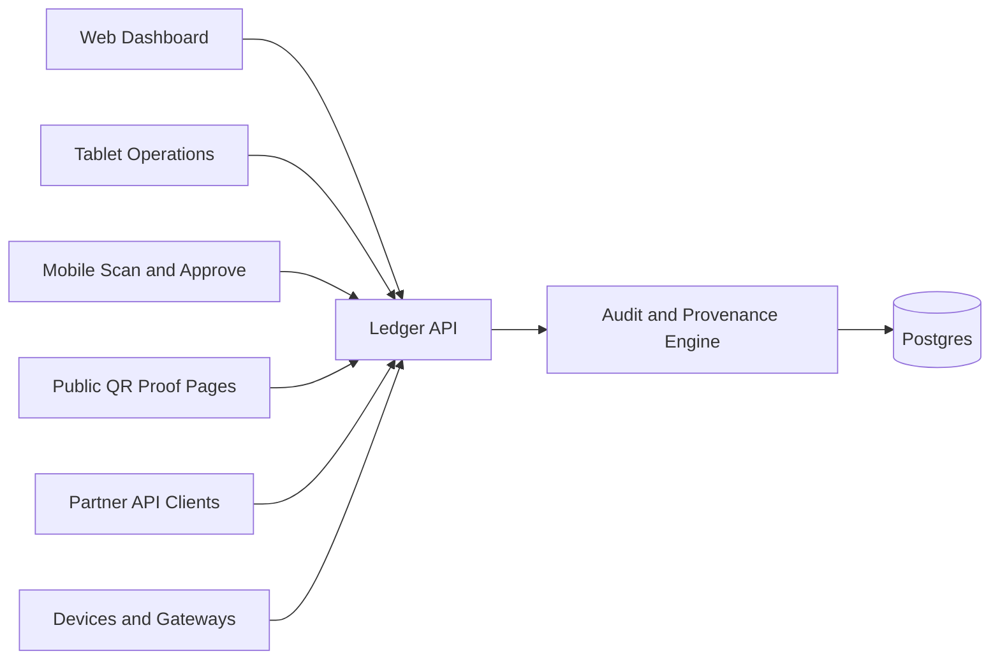

# True North Ledger

True North Ledger is an API-first audit and provenance platform for human workflows, business integrations, and secure device ingestion.

The product goal is simple: every actor has an identity, and every meaningful action becomes an auditable ledger event.

## Current Workspace

This repository is an Nx workspace using pnpm.

**Current Status:** Foundation Phase Complete (Post-Postgres Migration)

Implemented now:

- `apps/ledger-web` - Angular web application with routing, SCSS, Vitest, and Playwright
- `apps/ledger-web-e2e` - Playwright e2e project with 14 quality gates
- `apps/ledger-api` - NestJS REST API with PostgreSQL persistence and full ledger events module
- `libs/shared-models` - Unified contract library exports
- `libs/ledger-contracts` - Core Zod schemas for ledger events and metadata
- `libs/auth-contracts` - Actor type and permission schemas  
- `libs/device-contracts` - Device ledger event schemas
- `libs/audit-contracts` - Audit metadata schemas
- Docker Compose infrastructure (PostgreSQL, Redis, PgAdmin)

**Test Coverage:**
- Backend: 100% statements, 100% functions, 80.5% branches, 31 tests (22 unit + 9 integration)
- Frontend: 3 tests with Observable patterns
- E2E: 14 Playwright quality gates

**Architecture:**
- Schema-driven contracts with Zod validation across frontend and API
- Observable-based reactive patterns (RxJS) for all async operations
- PostgreSQL persistence with TypeORM
- SHA-256 payload hash verification
- Docker Compose development environment

Planned platform parts:
- Docker Compose infrastructure for Postgres, Redis, API, web, observability, and reverse proxy.
- Device gateway and MQTT broker when real IoT volume requires them.

## Platform Shape



## Core Principles

- Postgres is the system of record.
- NestJS writes and validates truth.
- Angular visualizes and operates on truth.
- Every write creates a ledger event.
- Users, services, devices, and system jobs all have auditable identities.
- WebSockets notify clients; they are not the source of truth.
- MQTT is a later ingestion option, not an MVP dependency.

## Getting Started

### Quick Start

Install dependencies:

```sh
pnpm install
```

Start all services (infrastructure + apps):

```sh
pnpm start:all
```

Or start services individually:

Start infrastructure:

```sh
pnpm docker:up
```

Start API server:

```sh
pnpm start:api
```

Start web application:

```sh
pnpm start:web
```

Stop infrastructure:

```sh
pnpm docker:down
```

Run tests:

```sh
pnpm nx test ledger-api
pnpm nx test ledger-web
pnpm nx e2e ledger-web-e2e
```

### Development Workflow

List all projects:

```sh
pnpm nx show projects
```

Build all:

```sh
pnpm nx run-many -t build
```

Test all:

```sh
pnpm nx run-many -t test
```

## Project Planning & Roadmap

**Current Phase:** Foundation Complete - Ready for PI-1

### Planning Documents

All planning documents are located in the [`planning/`](planning/) folder:

- **[PI-1 Planning](planning/PI-1-PLANNING.md)** - 10-week program increment plan (5 sprints)
  - Sprint 1: Authentication & Authorization (Weeks 1-2)
  - Sprint 2: Device Management & Identity (Weeks 3-4)  
  - Sprint 3: Orders Module & Ledger Integration (Weeks 5-6)
  - Sprint 4: Inventory Module & Provenance (Weeks 7-8)
  - Sprint 5: WebSocket Notifications & Production Infrastructure (Weeks 9-10)

- **[Sprint Task Documents](planning/)** - Detailed task breakdowns:
  - [Sprint 1 Tasks](planning/SPRINT-1-TASKS.md) - Authentication & Authorization
  - [Sprint 2 Tasks](planning/SPRINT-2-TASKS.md) - Device Management & Identity
  - [Sprint 3 Tasks](planning/SPRINT-3-TASKS.md) - Orders Module & Ledger Integration
  - [Sprint 4 Tasks](planning/SPRINT-4-TASKS.md) - Inventory Module & Provenance
  - [Sprint 5 Tasks](planning/SPRINT-5-TASKS.md) - WebSocket Notifications & Production

- **[Current State Assessment](planning/CURRENT-STATE.md)** - What's done vs. what's planned
- **[PI Planning Guide](planning/PI-PLANNING-GUIDE.md)** - How to use the planning documents

### What's Next (PI-1 Goals)

By end of PI-1 (10 weeks), the platform will have:

- ✅ Secure authentication for all actor types (USER, SERVICE, DEVICE, SYSTEM)
- ✅ Device registration, authentication, and event ingestion
- ✅ Orders module with full audit trail
- ✅ Inventory tracking with device scan integration  
- ✅ Real-time WebSocket notifications
- ✅ Production infrastructure with monitoring
- ✅ Public proof verification system
- ✅ OpenAPI/Swagger documentation

## Documentation

### Architecture & Design

- [Documentation Index](documentation/README.md)
- [Project Overview](documentation/overview/project-overview.md)
- [Architecture](documentation/architecture/architecture.md)
- [Applications](documentation/operations/applications.md)
- [API Design](documentation/platform/api-design.md)
- [Auditability Plan](documentation/platform/auditability-plan.md)
- [Ledger Model](documentation/platform/ledger-model.md)
- [Device Ingestion](documentation/platform/device-ingestion.md)
- [Security Model](documentation/platform/security-model.md)
- [Data Model](documentation/architecture/data-model.md)
- [Infrastructure](documentation/operations/infrastructure.md)

### Development Guides

- [Development Workflow](documentation/development/development-workflow.md)
- [Testing and Quality Gates](documentation/development/testing-quality-gates.md)
- [Coding Standards](documentation/development/coding-standards.md)

### Planning & Roadmap

All planning documents are in the [`planning/`](planning/) folder:

- [PI-1 Planning](planning/PI-1-PLANNING.md) - Overall program increment plan
- [Sprint Task Documents](planning/) - Detailed sprint breakdowns (Sprints 1-5)
- [Current State Assessment](planning/CURRENT-STATE.md) - Progress tracking
- [PI Planning Guide](planning/PI-PLANNING-GUIDE.md) - How to use planning docs

## Known Issues

### RxJS TypeScript Deprecation Warnings

You may see TypeScript deprecation warnings from RxJS v7.8.2 in VS Code:

```
Option 'moduleResolution=node10' is deprecated...
Option 'baseUrl' is deprecated...
```

**These are benign warnings from the RxJS library's own `tsconfig.json` in `node_modules`.** They:
- ✅ Do not affect builds, tests, or runtime
- ✅ Are not errors in your code
- ✅ Cannot be fixed by modifying workspace configuration
- ✅ Will be resolved when RxJS releases an updated version

All builds and tests pass successfully despite these informational warnings.
