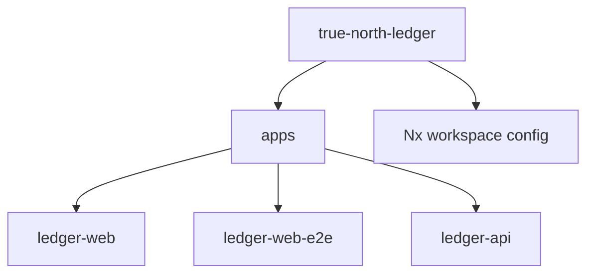
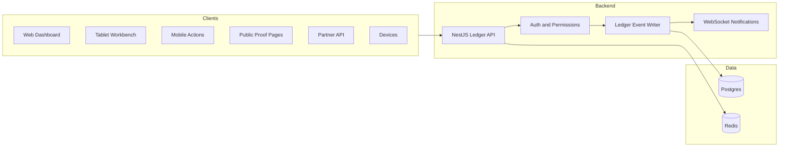
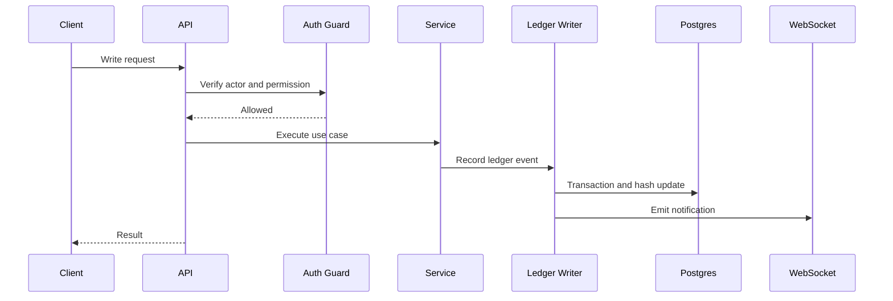

# Architecture

True North Ledger uses an Nx monorepo so applications, shared contracts, and infrastructure can evolve together.

This document describes the architecture and platform shape. For the product narrative, end-user goals, and business-facing context, see [Product Brief](../overview/product-brief.md).

## Current Repo State

## Target Platform

## Request Flow

## Design Rules

- REST is the first write path.
- WebSockets provide live updates after durable writes.
- MQTT is deferred until device volume or protocol requirements justify it.
- Ledger events are append-only.
- Feature libraries should expose contracts and behavior, not duplicate domain types.
- Shared runtime schema contracts should validate the same request, response, and persisted event shapes across frontend, API, and storage.
- API permissions are enforced before UI route gating; web, tablet, and mobile views should derive visibility from the same role/permission model.
- Frontend styling should flow through the shared UX system in [Frontend UX System](../development/frontend-ux-system.md): `styles.scss`, `styles/` partials, MD3 overrides, reusable components, and reduced-motion-aware animations.
- Gamified UI elements must derive from API, permission, or ledger state; the browser never becomes the source of truth.
