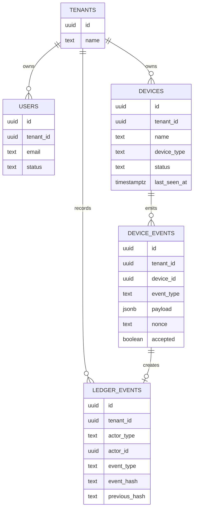

# Data Model

Postgres is the primary database. Current-state tables support product workflows; `ledger_events` remains the canonical audit trail.

## Core Tables

## Device Tables

`devices`:

- `id uuid primary key`
- `tenant_id uuid not null`
- `name text not null`
- `device_type text not null`
- `status text not null`
- `public_key text`
- `certificate_fingerprint text`
- `last_seen_at timestamptz`
- `created_at timestamptz not null`
- `revoked_at timestamptz`

`device_events`:

- `id uuid primary key`
- `tenant_id uuid not null`
- `device_id uuid not null`
- `event_type text not null`
- `payload jsonb not null`
- `nonce text not null`
- `signature text`
- `accepted boolean not null`
- `rejection_reason text`
- `created_at timestamptz not null`
- `ledger_event_id uuid`
