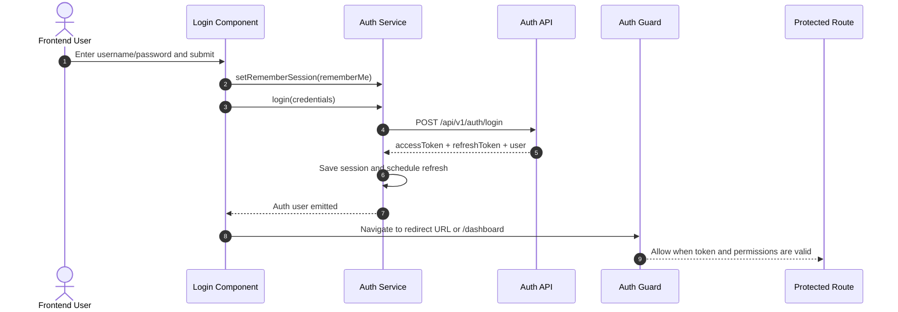

# Frontend Login Flow Guide

This guide explains how the web client handles authentication from login submission through guarded navigation, token refresh, and logout.

## Scope

- App: `apps/ledger-web`
- Auth API root: `/api/v1/auth`
- Primary implementation files:
  - `apps/ledger-web/src/app/pages/login/login.component.ts`
  - `apps/ledger-web/src/app/auth.service.ts`
  - `apps/ledger-web/src/app/auth.interceptor.ts`
  - `apps/ledger-web/src/app/auth.guard.ts`

## Flow Overview



## Session Storage Decision

Sprint 1 implementation uses bearer JWTs in Web Storage:

- Default storage is `sessionStorage`.
- Persistent storage uses `localStorage` only when Remember Me is explicitly enabled.
- This reduces token persistence across browser restarts by default.

## Step-by-Step Behavior

### 1. User submits login form

- `LoginComponent` validates required fields.
- Remember Me is forwarded to `AuthService.setRememberSession(...)` before login request.
- `AuthService.login(...)` sends `POST /api/v1/auth/login`.

### 2. Auth service saves session

On successful response:

- Stores `accessToken`, `refreshToken`, and `user` in selected storage backend.
- Clears auth artifacts from the non-selected storage backend.
- Emits authenticated state through `authState$` and `isAuthenticated$`.
- Schedules automatic refresh before token expiration.

### 3. Redirect and protected navigation

- If an intended route exists, login redirects there.
- Otherwise login redirects to `/dashboard`.
- `authGuard` enforces both authentication and route permission metadata.

### 4. API calls and auto-refresh

- `auth.interceptor.ts` attaches `Authorization: Bearer <accessToken>` for protected API routes.
- On `401`, interceptor attempts `POST /api/v1/auth/refresh`.
- If refresh succeeds, original request is retried with fresh token.
- If refresh fails, session is cleared and routing returns to login.

### 5. Logout

- `AuthService.logout()` clears local session state first.
- If a refresh token exists, frontend calls `POST /api/v1/auth/logout`.
- User is routed back to login and protected routes are no longer accessible.

## Error Handling Rules

- Invalid credentials: show API error text on login page.
- Missing refresh token: fail fast and clear session.
- `403` from protected route: redirect to unauthorized page.
- Throttled auth endpoints (`429`): keep user on login and surface retry guidance.

## Frontend Test Coverage

Unit and e2e coverage for this flow exists in:

- `apps/ledger-web/src/app/auth.service.spec.ts`
- `apps/ledger-web/src/app/auth.interceptor.spec.ts`
- `apps/ledger-web/src/app/auth.guard.spec.ts`
- `apps/ledger-web/src/app/pages/login/login.component.spec.ts`
- `apps/ledger-web-e2e/src/login.spec.ts`

Recommended validation commands:

```sh
pnpm nx test ledger-web
pnpm nx e2e ledger-web-e2e --grep "login|refresh|unauthorized|permission"
```

## Related Documents

- `documentation/development/getting-started-authentication.md`
- `documentation/platform/auth-api-reference.md`
- `documentation/platform/security-model.md`
- `documentation/platform/auth-troubleshooting.md`