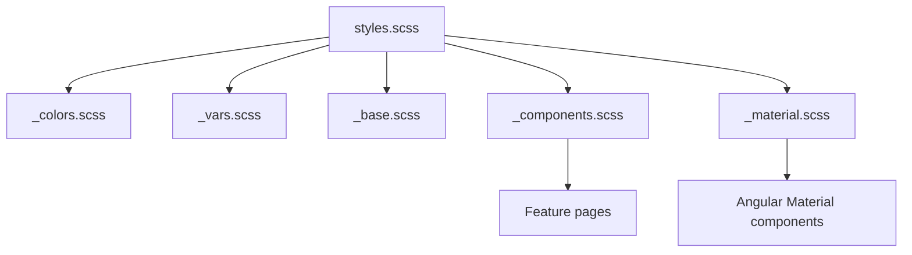
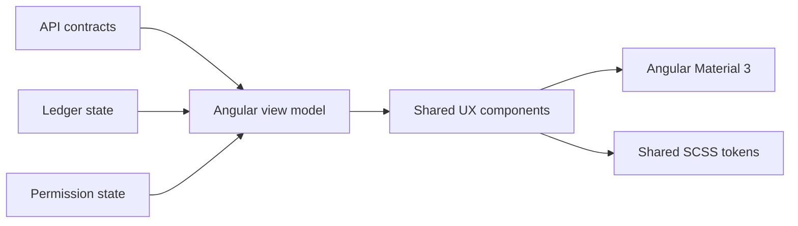

# Frontend UX System

The Ledger web UI should use a shared Angular Material 3 and SCSS foundation so visual polish does not turn into page-by-page CSS growth. Gamification and animation are product behavior only when they reflect server, permission, or ledger state.

## Style Architecture

`apps/ledger-web/src/styles.scss` is the global style entrypoint. It should import shared partials only:

- `styles/_colors.scss`: MD3-compatible color tokens and state colors.
- `styles/_vars.scss`: spacing, radius, elevation, layout, and typography variables.
- `styles/_base.scss`: document defaults, focus visibility, and accessibility defaults.
- `styles/_components.scss`: reusable app-level component classes.
- `styles/_material.scss`: Angular Material/MD3 component overrides.
- `styles/_mixins.scss`: shared helpers for surfaces, buttons, and repeated layout patterns.

## Budget Rules

- Add reusable styles to `styles/` before adding one-off page styles.
- Prefer Angular Material and MD3 tokens for color, density, typography, focus, menu, dialog, snackbar, and tooltip behavior.
- Keep page component SCSS focused on layout details unique to that page.
- Reuse shared Angular components for chips, trust seals, mission cards, progress rails, timelines, proof hash panels, event cards, and empty states.
- Keep animations in reusable triggers, and honor `prefers-reduced-motion`.
- Do not let browser-only badges, scores, or animations become a source of truth. They must derive from API, permission, or ledger state.

## Shared UX Components

Prioritize these components across PI-1:

- `StatusChipComponent`
- `SeverityChipComponent`
- `TrustSealComponent`
- `MissionCardComponent`
- `ProgressRailComponent`
- `TimelineRailComponent`
- `LedgerEventCardComponent`
- `ProofHashCardComponent`
- `ConnectionStatusComponent`
- `EmptyStateComponent`

## Testing Expectations

New visual primitives need unit tests for state variants and Playwright coverage when they enter a user workflow.

- Verify accessible names on icon buttons.
- Verify non-color status text or icons for every state.
- Verify reduced-motion behavior for route, card, event, scan, proof, and connection animations.
- Verify responsive layouts at mobile, tablet, and desktop sizes.
- Verify no horizontal overflow, clipped chip text, or overlapping timeline labels.
