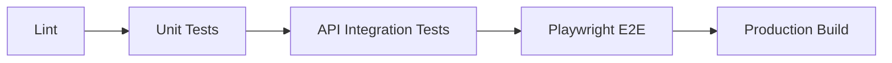

# Testing and Quality Gates

Security, auditability, and quality need layered tests. Playwright should enforce browser-facing quality, while API and unit tests enforce server-side rules.

## Current Quality Metrics

Coverage percentages are not currently enforced as a release gate. Use behavior coverage and the command baseline below until explicit coverage thresholds are added.

**Test Suites:**
- `ledger-api`: 7 Jest suites / 42 tests
- `ledger-web`: 2 Vitest files / 4 tests
- Device event creation tests
- Hash validation and integrity tests
- Observable stream behavior tests
- Validation pipe error handling tests
- Controller endpoint tests with error scenarios
- Auth denial, permission denial, tenant isolation, strict DTO rejection, chain verification, and rate-limit behavior tests
- CI requires repository secrets `CI_POSTGRES_PASSWORD` and `CI_JWT_SECRET`; do not hardcode reusable CI credentials in workflow YAML.
- Full-stack Playwright JWT checks cover browser token storage, Angular request headers, API authorization, Postgres persistence, API reload, UI rendering, and unauthorized-token error handling.

**E2E Tests (ledger-web-e2e):**
- 145 Playwright checks across Chromium, Firefox, WebKit, Mobile Chrome, and Mobile Safari
- Responsive design validation (mobile, tablet, desktop)
- Navigation and accessibility tests
- Browser error detection
- Security checks (no insecure HTTP)

## Quality Gate Order



## Playwright Baseline

Current `ledger-web-e2e` checks enforce:

- No browser console errors.
- No page runtime errors.
- No insecure external `http` requests.
- Required document basics: title, language, viewport, and app root.
- Protected outbound links using `rel="noreferrer"`.
- No secret-like values in local or session storage.
- No horizontal overflow at mobile, tablet, or desktop viewports.
- Desktop and mobile browser projects.

## Future Playwright Checks

Add these when the real app shell exists:

- Keyboard navigation through primary routes.
- Accessible names on icon buttons and form controls.
- Authentication redirect behavior.
- Role-based route access.
- Audit event visibility after user actions.
- Proof pages expose only proof-safe data.
- Tablet and mobile task flows remain usable at target viewport sizes.
- Shared Zod contracts enforce request and response shapes across frontend and API.
- Unit tests should exercise contract validation and event append behavior.

## API and Backend Checks

Playwright cannot prove server-side security by itself. Add API/integration tests for:

- Permission guards.
- Tenant isolation.
- Rate limiting.
- Input validation.
- Ledger append-only behavior.
- Hash-chain integrity.
- Device nonce replay protection.
- Rejected write audit records.

## CI Baseline

Recommended full baseline:

```sh
pnpm nx run-many -t lint test build
pnpm nx e2e ledger-web-e2e
```

Use `pnpm nx affected` once the repo has enough projects for dependency-aware CI.
