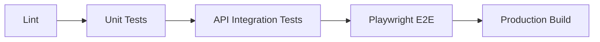

# Testing and Quality Gates

Security, auditability, and quality need layered tests. Playwright should enforce browser-facing quality, while API and unit tests enforce server-side rules.

## Quality Gate Order



## Playwright Baseline

Current `ledger-web-e2e` checks enforce:

- No browser console errors.
- No page runtime errors.
- No insecure external `http` requests.
- Required document basics: title, language, viewport, and app root.
- Protected outbound links using `rel="noreferrer"`.
- No secret-like values in local or session storage.
- No horizontal overflow at mobile, tablet, or desktop viewports.
- Desktop and mobile browser projects.

## Future Playwright Checks

Add these when the real app shell exists:

- Keyboard navigation through primary routes.
- Accessible names on icon buttons and form controls.
- Authentication redirect behavior.
- Role-based route access.
- Audit event visibility after user actions.
- Proof pages expose only proof-safe data.
- Tablet and mobile task flows remain usable at target viewport sizes.

## API and Backend Checks

Playwright cannot prove server-side security by itself. Add API/integration tests for:

- Permission guards.
- Tenant isolation.
- Rate limiting.
- Input validation.
- Ledger append-only behavior.
- Hash-chain integrity.
- Device nonce replay protection.
- Rejected write audit records.

## CI Baseline

Recommended full baseline:

```sh
pnpm nx run-many -t lint test build
pnpm nx e2e ledger-web-e2e
```

Use `pnpm nx affected` once the repo has enough projects for dependency-aware CI.
