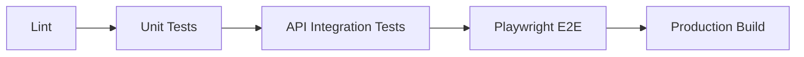
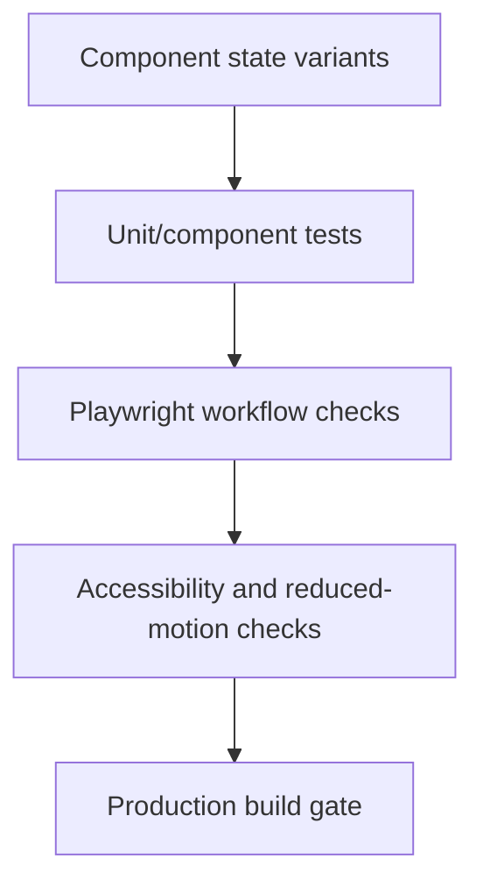

# Testing and Quality Gates

Security, auditability, and quality need layered tests. Playwright should enforce browser-facing quality, while API and unit tests enforce server-side rules.

## Current Quality Metrics

Coverage percentages are not currently enforced by tool configuration. Sprint 1 local closeout on 2026-06-04 used the command baseline below plus `pnpm nx run-many -t test --coverage --skip-nx-cache`.

Current `ledger-web` coverage from the 2026-06-04 local closeout run:

- Statements: 91.41%
- Branches: 83.92%
- Functions: 96.41%
- Lines: 92.99%

Branch coverage remains below 90% because Angular template/compiler branches and placeholder page templates are included in aggregate reporting. Treat statements/functions/lines plus behavior coverage as the Sprint 1 practical gate until explicit branch thresholds or new-code-only coverage reporting are added.

**Test Suites:**
- `ledger-api`: Jest unit/integration suites
- `ledger-web`: Vitest unit/component suites
- Device event creation tests
- Hash validation and integrity tests
- Observable stream behavior tests
- Validation pipe error handling tests
- Controller endpoint tests with error scenarios
- Auth denial, permission denial, tenant isolation, strict DTO rejection, chain verification, and rate-limit behavior tests
- CI requires repository secrets `CI_POSTGRES_PASSWORD` and `CI_JWT_SECRET`; do not hardcode reusable CI credentials in workflow YAML.
- Full-stack Playwright JWT checks cover browser token storage, Angular request headers, API authorization, Postgres persistence, API reload, UI rendering, and unauthorized-token error handling.

**E2E Tests (ledger-web-e2e):**
- Playwright checks across Chromium, Firefox, WebKit, Mobile Chrome, and Mobile Safari
- Responsive design validation (mobile, tablet, desktop)
- Navigation and accessibility tests
- Browser error detection
- Security checks (no insecure HTTP)

## Quality Gate Order



## Playwright Baseline

Current `ledger-web-e2e` checks enforce:

- No browser console errors.
- No page runtime errors.
- No insecure external `http` requests.
- Required document basics: title, language, viewport, and app root.
- Protected outbound links using `rel="noreferrer"`.
- No unexpected secret-like values in local or session storage; auth-token storage must be covered by explicit auth tests until the production storage model is finalized.
- No horizontal overflow at mobile, tablet, or desktop viewports.
- Desktop and mobile browser projects.

## Future Playwright Checks

Add these when the real app shell exists:

- Keyboard navigation through primary routes.
- Accessible names on icon buttons and form controls.
- Authentication redirect behavior.
- Role-based route access.
- Audit event visibility after user actions.
- Proof pages expose only proof-safe data.
- Tablet and mobile task flows remain usable at target viewport sizes.
- Shared Zod contracts enforce request and response shapes across frontend and API.
- Unit tests should exercise contract validation and event append behavior.
- Shared MD3 visual primitives render expected state variants for chips, trust seals, mission cards, progress rails, timelines, proof hash cards, and connection status.
- Reduced-motion mode preserves route, card, scan, proof, and live-event usability without relying on animation.
- Visual state assertions verify labels/icons/business state instead of brittle animation timing.
- Mobile, tablet, and desktop checks cover dashboard cards, chips, rails, timelines, and live feeds for text clipping or horizontal overflow.



## Frontend Visual Quality Checks

For each new visual primitive or gamified element:

- Unit test success, warning, error, empty, loading, disabled, and permission-denied states where applicable.
- Add Playwright coverage the first time the primitive enters auth, devices, orders, inventory, proofs, or live operations.
- Verify icon-only controls have accessible names.
- Verify no state relies on color alone.
- Verify state comes from API, permission, or ledger data rather than hardcoded client success.
- Keep reusable styling in `apps/ledger-web/src/styles.scss` and `apps/ledger-web/src/styles/` partials.

## API and Backend Checks

Playwright cannot prove server-side security by itself. Add API/integration tests for:

- Permission guards.
- Tenant isolation.
- Rate limiting.
- Input validation.
- Ledger append-only behavior.
- Hash-chain integrity.
- Device nonce replay protection.
- Rejected write audit records.

## CI Baseline

Recommended full baseline:

```sh
pnpm nx run-many -t lint test build
pnpm nx e2e ledger-web-e2e
pnpm audit --audit-level high
```

Use `pnpm nx affected` once the repo has enough projects for dependency-aware CI.
