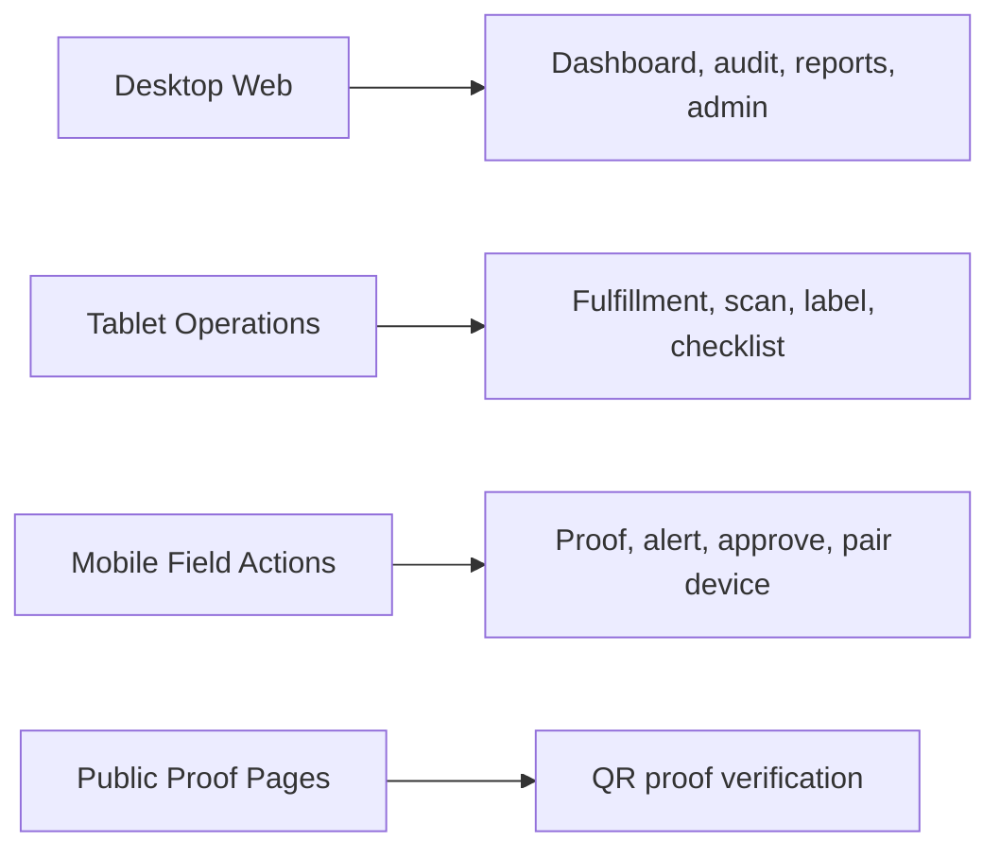

# Applications

## `ledger-web`

Current Angular application.

Purpose:

- Responsive command center for administrators and operators.
- Future adaptive routes for desktop, tablet, and mobile workflows.
- Built with Angular, SCSS, routing, guarded auth routes, Vitest, and Playwright.
- Uses the shared frontend UX system for MD3 styles, Material Icons, reusable visual primitives, and reduced-motion-aware animations.

Run:

```sh
pnpm start:web
```

Build:

```sh
pnpm nx build ledger-web
```

Test:

```sh
pnpm nx test ledger-web
```

## `ledger-web-e2e`

Current Playwright project for browser-level tests.

Run:

```sh
pnpm nx e2e ledger-web-e2e
```

## `ledger-api`

Current NestJS API for the platform.

Responsibilities:

- Authenticated ledger event endpoints.
- Tenant isolation, permissions, rate limiting, and error normalization.
- Server-controlled audit metadata and hash-chain fields.
- Swagger/OpenAPI documentation at `/api/docs` and `/api/docs-json`.
- Future orders, inventory, donations, proofs, devices, audit, and anomaly endpoints.

## Planned UI Modes



## Route Intent

- `/dashboard` - command center.
- `/ledger-events` - event stream and detail review.
- `/orders` - order history and status.
- `/inventory` - stock and provenance.
- `/donations` - donation proof administration.
- `/devices` - device registry and status.
- `/proofs` - proof lookup and management.
- `/audit` - audit trails.
- `/anomalies` - fraud and anomaly review.
- `/settings` - tenant and platform settings.
- `/tablet/*` - touch-first operations flows.
- `/m/*` - mobile scan, approve, alert, and proof flows.

Role and surface-specific route access is defined in [RBAC and Role-Specific Views](../platform/rbac-and-views.md).

Shared styling, gamification, and visual testing guidance is defined in [Frontend UX System](../development/frontend-ux-system.md).
