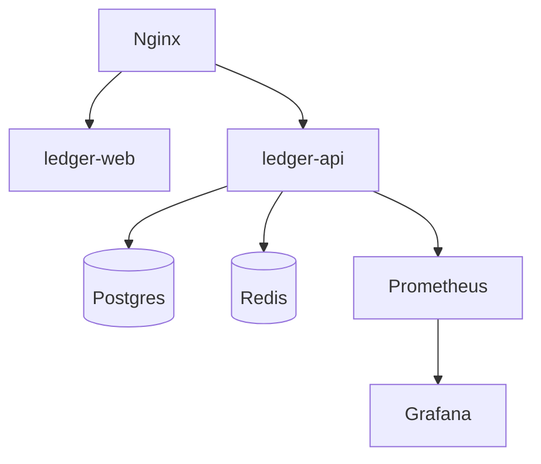

# Infrastructure

The platform should start with Docker Compose and move to Kubernetes only when scale, deployment, or contract requirements justify it.

## MVP Compose Services

## Future Services

- `proof-web` - public proof verification app if split from `ledger-web`.
- `device-gateway` - edge or protocol bridge for IoT ingestion.
- `mqtt-broker` - Mosquitto or EMQX when MQTT is needed.
- `go-worker` - optional high-throughput worker for ingestion or proofs.

## Observability

Track:

- API request counts and latency.
- Ledger write failures.
- Device heartbeat status.
- Rejected device events.
- Authentication failures.
- Queue depth if Redis-backed jobs are added.
