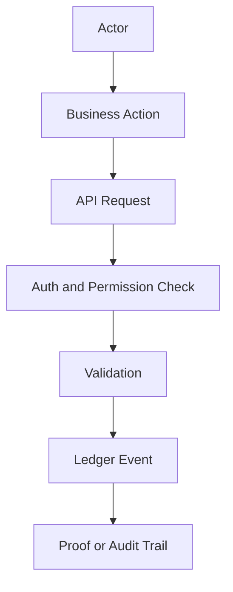

# Project Overview

True North Ledger is a responsive, API-first audit platform for humans, businesses, and devices.

It is not only an admin dashboard. The UI is one client among several: web, tablet, mobile, public proof pages, partner APIs, and device ingestion all write to or read from the same ledger-backed platform.

This overview focuses on the project shape and platform direction. For a concise product narrative and business-oriented brief, see [Product Brief](product-brief.md).

## Product Statement

True North Ledger captures meaningful business actions as verifiable ledger events so operational history can be reviewed, proven, and trusted.

## Main Actors

- `user` - human operator, admin, manager, or field worker.
- `service` - internal service, worker, script, or partner integration.
- `device` - scanner, printer, sensor, kiosk, tablet station, or edge gateway.
- `system` - platform-owned automated process.

Human users are authorized through RBAC roles such as `admin`, `operations_manager`, `inventory`, `shipping`, `billing`, `moderator`, `auditor`, `device_technician`, `support`, and `viewer`. Sprint 1 is turning the Sprint 0 guard foundation into product authentication with seeded roles, login/session UX, permission-aware navigation, and route gating.

## Main Workflows

## Success Criteria

- Every write can be traced to an actor.
- Every important state change has a ledger event.
- Public proof pages can verify selected records without exposing private operational data.
- Devices are first-class identities, not anonymous API callers.
- UI experiences are shaped by workflow: web for command center, tablet for operations, mobile for scan and approve.
- Role-specific routes are planned from the beginning across web, tablet, and mobile surfaces.
- Gamification, Material Icons, MD3 styling, and Angular animations should make verified work clearer without becoming a client-side source of truth.
