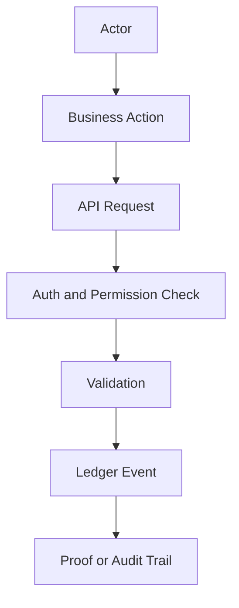

# Project Overview

True North Ledger is a responsive, API-first audit platform for humans, businesses, and devices.

It is not only an admin dashboard. The UI is one client among several: web, tablet, mobile, public proof pages, partner APIs, and device ingestion all write to or read from the same ledger-backed platform.

## Product Statement

True North Ledger captures meaningful business actions as verifiable ledger events so operational history can be reviewed, proven, and trusted.

## Main Actors

- `USER` - human operator, admin, manager, or field worker.
- `SERVICE` - internal service, worker, script, or partner integration.
- `DEVICE` - scanner, printer, sensor, kiosk, tablet station, or edge gateway.
- `SYSTEM` - platform-owned automated process.

## Main Workflows

## Success Criteria

- Every write can be traced to an actor.
- Every important state change has a ledger event.
- Public proof pages can verify selected records without exposing private operational data.
- Devices are first-class identities, not anonymous API callers.
- UI experiences are shaped by workflow: web for command center, tablet for operations, mobile for scan and approve.
