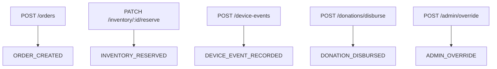

# API Design

The API should be designed for humans, services, partners, and devices from the start.

## API Areas

- `/api/v1/auth`
- `/api/v1/users`
- `/api/v1/roles`
- `/api/v1/orders`
- `/api/v1/inventory`
- `/api/v1/donations`
- `/api/v1/ledger/events`
- `/api/v1/proofs`
- `/api/v1/devices`
- `/api/v1/device-events`
- `/api/v1/audit`
- `/api/v1/anomalies`

## Write Rule

Every API write creates a ledger event.

Role and permission checks must happen before business writes. UI route gating is helpful, but API permission guards are the source of authorization truth.

## Schema Contracts

Requests and responses are validated by shared Zod schemas in `libs/shared-models` and focused contract libraries such as `libs/ledger-contracts`, `libs/device-contracts`, and `libs/order-contracts`. This ensures the frontend and API agree on event shape, metadata requirements, and audit fields.

## Event Metadata

Each write should capture:

- Actor type and actor id.
- Tenant id.
- Request id and correlation id.
- Source IP.
- User agent or device agent.
- Event type.
- Subject type and subject id.
- Payload hash.
- Previous hash.
- Timestamp.
- Result: `accepted`, `rejected`, or `failed`.

## Transport Choices

- REST for MVP writes and reads.
- WebSockets for live dashboard updates.
- MQTT later for high-volume or lightweight device networks.
