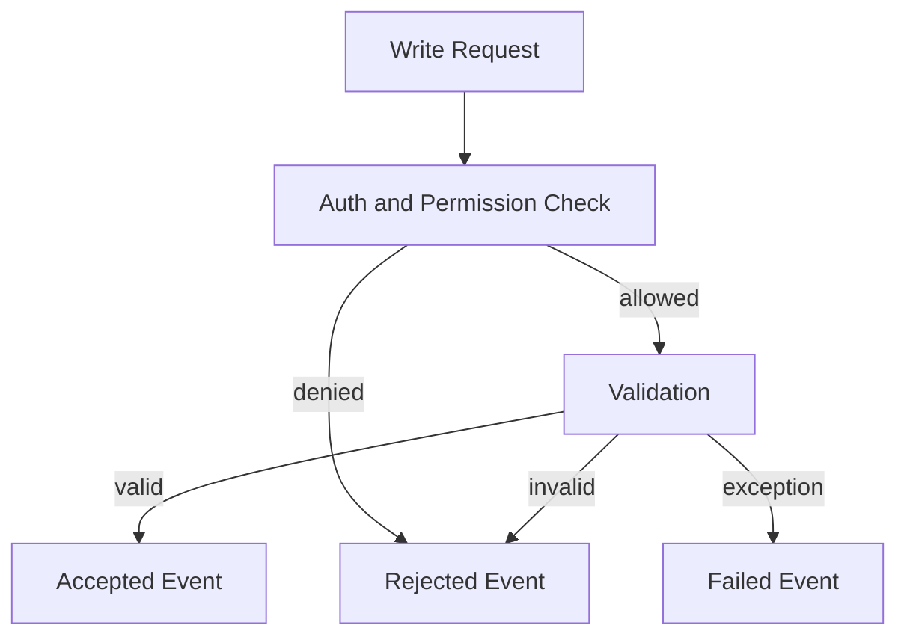

# Auditability Plan

Auditability should be designed before implementation. The platform cannot rely on after-the-fact logging to explain sensitive operations.

## Audit Standard

Every meaningful write must answer:

- Who or what acted?
- What permission allowed it?
- What subject changed?
- What payload was accepted or rejected?
- What request and correlation id connect related work?
- What previous ledger event anchors this event?
- What result was returned?

## Required Event Outcomes

## Build Requirements

- Every API write path must call the ledger event writer.
- Rejected sensitive writes must create audit records where safe.
- Event payloads must be normalized before hashing.
- Event hashes must include tenant, actor, subject, payload hash, previous hash, result, and timestamp.
- Historical ledger rows must not be updated by application code.
- Admin overrides must require explicit permission and reason capture.

## Test Requirements

- Unit tests for event hash determinism.
- Integration tests for append-only behavior.
- API tests proving every write creates a ledger event.
- Rejection tests proving denied writes are auditable.
- E2E tests proving user-visible audit trails expose request outcomes.
