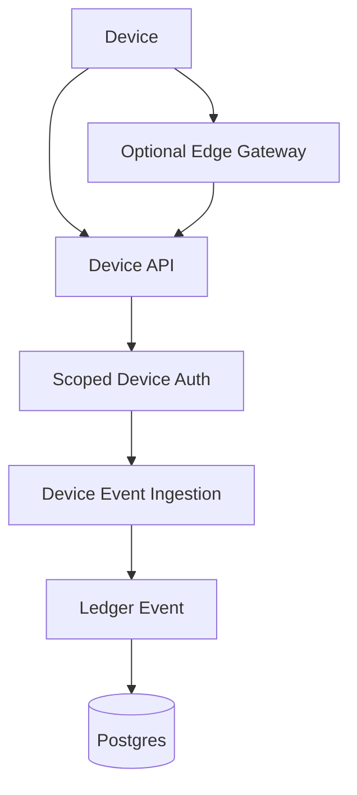

# Device Ingestion

Devices are first-class actors. Scanners, label printers, sensors, kiosks, gateways, and tablets should not share one anonymous token.

## Device Flow



## Planned Endpoints

- `POST /api/v1/devices/register`
- `POST /api/v1/devices/heartbeat`
- `GET /api/v1/devices/:id/status`
- `POST /api/v1/device-events`
- `POST /api/v1/device-events/batch`

## Device Identity

Minimum fields:

- `device_id`
- `device_name`
- `device_type`
- `tenant_id`
- `public_key` or `certificate_fingerprint`
- `status`
- `last_seen_at`
- `permissions`
- `created_at`
- `revoked_at`

## Device Event Shape

```ts
export interface DeviceLedgerEvent {
  deviceId: string;
  eventType: string;
  timestamp: string;
  payload: Record<string, unknown>;
  nonce: string;
  signature?: string;
}
```

## MVP Auth

- Scoped device tokens.
- Nonce support to reduce replay risk.
- Rate limiting per device.
- Optional signed payloads for higher-trust devices.

## Later Auth

- mTLS.
- Device certificates.
- Hardware-backed keys.
- Certificate rotation.
- MQTT broker plus ingestion worker.
