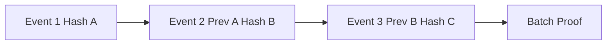

# Ledger Model

The ledger is the canonical audit trail. Domain tables may store current state, but ledger events explain how that state changed.

## Event Chain

## Core Event Fields

- `id`
- `tenant_id`
- `actor_type`
- `actor_id`
- `event_type`
- `subject_type`
- `subject_id`
- `payload`
- `payload_hash`
- `previous_hash`
- `event_hash`
- `request_id`
- `correlation_id`
- `result`
- `created_at`

## Event Writer Responsibilities

- Validate actor permissions.
- Normalize event payloads.
- Enforce shared schema contracts before persisting ledger events.
- Hash the payload and previous event reference.
- Write inside a database transaction.
- Emit notifications after durable persistence.
- Reject direct mutation of historical events.

## Proofs

Proofs expose selected verification data without exposing private operational details.

Examples:

- Donation proof.
- Order provenance proof.
- Device event proof.
- Batch ledger proof.
