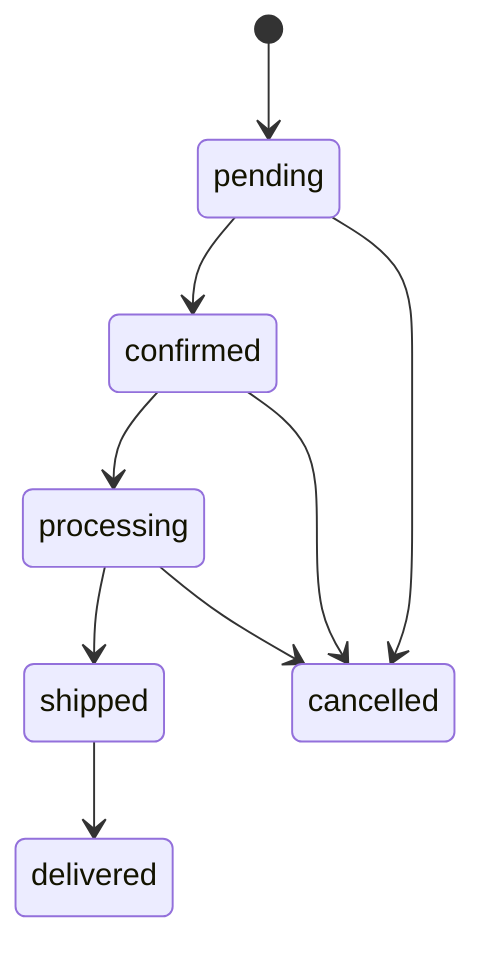
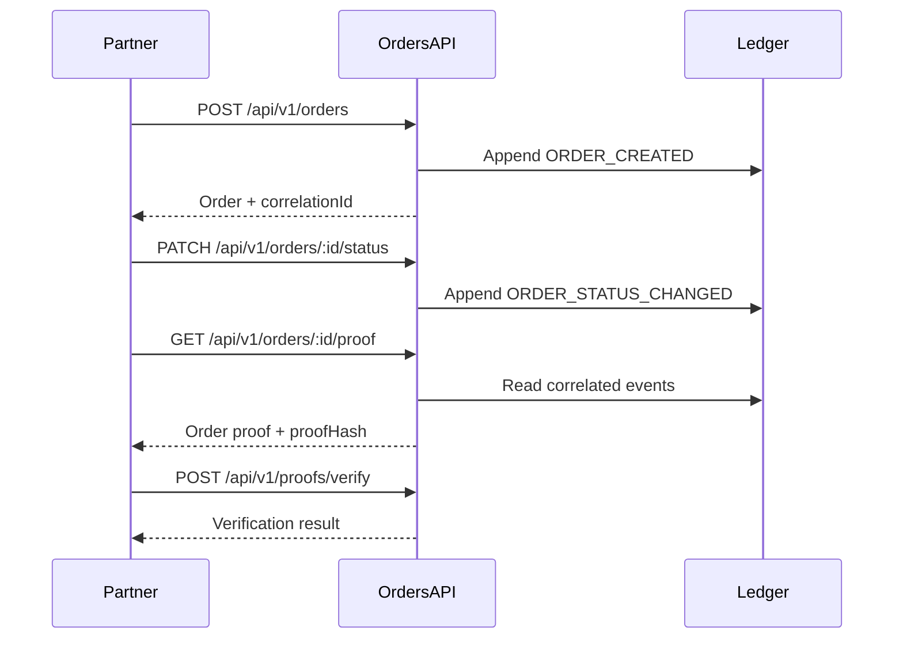

# Order Management

Sprint 3 provides tenant-scoped order lifecycle management with ledger audit events, correlation tracking, and verifiable proofs.

## Quick Start

Prerequisites:

- PostgreSQL is running and reachable using the standard API database variables.
- The API and web application are running with `pnpm start:full`.
- The caller has a bearer token with the required order permissions.

Create an order:

```sh
curl -X POST http://localhost:3000/api/v1/orders \
  -H "Authorization: Bearer $TOKEN" \
  -H "Content-Type: application/json" \
  -d '{
    "customerId": "customer-100",
    "customerName": "Northwind Receiving",
    "customerEmail": "receiving@example.com",
    "items": [
      {
        "sku": "SKU-100",
        "name": "Serialized sensor kit",
        "quantity": 2,
        "unitPrice": 49.5
      }
    ],
    "shippingAddress": {
      "line1": "100 Warehouse Way",
      "city": "Austin",
      "region": "TX",
      "postalCode": "78701",
      "country": "US"
    },
    "metadata": { "source": "partner-api" },
    "idempotencyKey": "partner-order-customer-100-0001"
  }'
```

The response contains the generated `id`, display `orderNumber`, initial `pending` status, and `correlationId`.

## Lifecycle

The primary lifecycle is:

```text
pending -> confirmed -> processing -> shipped -> delivered
```

Allowed exception transition:

```text
pending|confirmed|processing -> cancelled
```

`delivered`, `cancelled`, and `failed` are terminal. Shipped and delivered orders cannot be cancelled.



Every accepted lifecycle write appends a ledger event containing the order ID, order number, tenant ID, correlation ID, actor metadata, result, and transition reason when supplied.

## API Workflow



Common endpoints:

| Method | Path | Permission | Purpose |
| --- | --- | --- | --- |
| `POST` | `/api/v1/orders` | `orders.write` | Create an idempotent order |
| `GET` | `/api/v1/orders` | `orders.read` | List, filter, sort, and paginate |
| `GET` | `/api/v1/orders/search` | `orders.read` | Search order/customer/metadata text |
| `GET` | `/api/v1/orders/:id` | `orders.read` | Get full detail and timeline |
| `PATCH` | `/api/v1/orders/:id/status` | `orders.status.write` | Advance lifecycle status |
| `POST` | `/api/v1/orders/:id/cancel` | `orders.status.write` | Cancel before shipment |
| `GET` | `/api/v1/orders/:id/timeline` | `orders.read` | Get chronological audit history |
| `GET` | `/api/v1/orders/:id/proof` | `proof.read` | Generate proof |
| `POST` | `/api/v1/proofs/verify` | `proof.read` | Verify proof hash and event chain |

Status update example:

```json
{
  "status": "confirmed",
  "reason": "Customer and payment details verified"
}
```

Cancellation example:

```json
{
  "reason": "Customer requested cancellation before shipment"
}
```

## Search

`GET /api/v1/orders` supports:

- `status`
- `customerId`
- `query`, matching order number, customer name, customer email, and metadata text
- `createdFrom` and `createdTo` as ISO date-time values
- `page` and `pageSize`
- `sortBy=createdAt|totalAmount`
- `sortDirection=asc|desc`

Example:

```sh
curl "http://localhost:3000/api/v1/orders?status=pending&query=northwind&page=1&pageSize=25&sortBy=totalAmount&sortDirection=asc" \
  -H "Authorization: Bearer $TOKEN"
```

The web Orders page exposes the same filters and provides **Reset filters** to return to the default newest-first list.

## Proof Verification

An order proof contains the order identity, correlation ID, generation metadata, chronological ledger events, and `proofHash`.

Verification checks:

1. The proof hash matches the canonical proof payload.
2. The first event is `ORDER_CREATED`.
3. Events are chronological.
4. Every event references the same order and correlation ID.
5. Status transitions form a valid event chain.

Submit the generated proof:

```sh
curl -X POST http://localhost:3000/api/v1/proofs/verify \
  -H "Authorization: Bearer $TOKEN" \
  -H "Content-Type: application/json" \
  -d '{ "proof": { "...": "generated proof JSON" } }'
```

A failed verification response includes a `reason`; do not treat a failed proof as authoritative.

## Error Responses

Order contracts define these domain error codes:

| Code | Typical HTTP status | Meaning |
| --- | --- | --- |
| `ORDER_INVALID_REQUEST` | `400` | Payload, filter, pagination, or sort validation failed |
| `ORDER_NOT_FOUND` | `404` | Order is absent or outside the caller tenant |
| `ORDER_CONFLICT` | `409` | Conflicting order operation |
| `ORDER_INVALID_STATUS_TRANSITION` | `409` | Requested lifecycle transition is not allowed |
| `ORDER_FORBIDDEN` | `403` | Caller lacks permission |

Authentication failures return `401`. Rate-limited creation requests return `429`.

## Partner Integration

- Always send a stable, partner-generated `idempotencyKey` for creation retries.
- Persist the returned `id`, `orderNumber`, and `correlationId`.
- Treat the server-calculated total as authoritative.
- Supply a human-readable `reason` for status changes and cancellations.
- Use list/search pagination instead of repeatedly downloading all orders.
- Generate and verify proofs when handing an order between trust boundaries.
- Never assume tenant access from an order ID; tenant isolation is enforced by the API token.

## UI State Model

- The completeness rail reflects validated customer, item, shipping, review, and proof readiness.
- Lifecycle milestones derive from the server order status and ledger timeline.
- Timeline entries show accepted/rejected/failed labels in addition to color.
- Proof indicators use pending, verified, and failed labels.
- Reduced-motion users receive zero-duration timeline and proof transitions.
- Long IDs and hashes wrap on narrow screens.

## Real-Time Updates

Order list and detail pages connect to the `/orders` Socket.IO namespace after authentication. The API validates the JWT access token, rejects revoked or unauthorized tokens, and joins accepted clients only to their tenant room.

Successful order creation, status changes, and cancellations publish an `order.updated` event. The web client validates the event contract and tenant ID before refreshing the active list or matching detail page.

The Angular development proxy forwards `/socket.io` WebSocket traffic to the ledger API on port `3000`.

## Environment And Testing

Orders use the standard API/PostgreSQL environment variables documented in `.env.example`; there are no order-specific secrets. `JWT_SECRET`, database connection variables, and configured authentication users/tokens are required for full-stack tests.

Focused quality gates:

```sh
pnpm nx run ledger-api:test -- --runTestsByPath src/app/orders/orders.service.spec.ts
pnpm nx run ledger-api:test -- --runTestsByPath src/app/orders/orders.integration.spec.ts
pnpm nx run ledger-web:test -- --include apps/ledger-web/src/app/pages/orders
pnpm nx run ledger-web-e2e:e2e-ci--src/orders.spec.ts
```

The integration and Playwright targets require PostgreSQL. Start local infrastructure with `pnpm docker:up` before running them.

## Troubleshooting

| Symptom | Check |
| --- | --- |
| `401` or `403` | Bearer token, tenant, and required permission |
| Duplicate retry creates another order | Reuse the original `idempotencyKey` |
| Status update rejected | Confirm the requested transition is allowed |
| Cancellation rejected | Confirm the order has not shipped |
| Empty search results | Reset filters and verify date-time boundaries |
| Proof verification fails | Regenerate the proof and confirm it was not modified |
| Real-time updates show disconnected | Confirm the API is current, the access token includes `admin` or `orders.read`, and `/socket.io` is proxied to port `3000` |
| API/e2e startup times out | Confirm PostgreSQL is listening and Docker Desktop is running |

## Contract Guarantees

- Shared contracts live in `libs/order-contracts` and are re-exported from `libs/shared-models`.
- Order numbers use the `ORD-YYYYMMDD-NNNN` display shape.
- Totals are derived from item quantity and unit price.
- Correlation IDs link creation, lifecycle, timeline, and proof data.
- Status timeline results are `accepted`, `rejected`, or `failed`.
