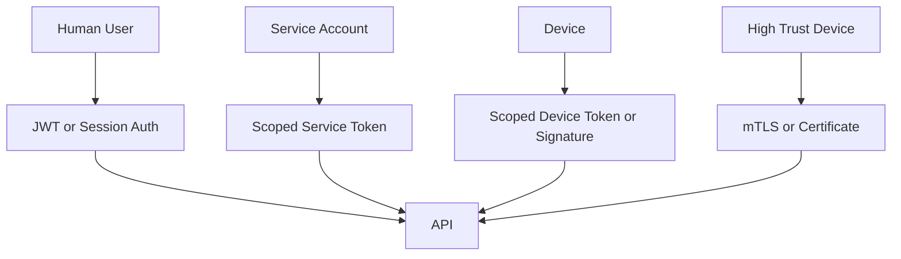

# Security Model

Security is based on actor identity, scoped permission, and auditable writes.

## Actor Types

```ts
export enum ActorType {
  USER = 'user',
  SERVICE = 'service',
  DEVICE = 'device',
  SYSTEM = 'system',
}
```

Human authorization is RBAC-based. Actor type identifies what is calling the API; roles and permissions identify what a human user can do. See [RBAC and Role-Specific Views](rbac-and-views.md) for the initial role and view matrix.

## Permission Examples

```ts
export enum LedgerPermission {
  LEDGER_READ = 'ledger.read',
  LEDGER_WRITE = 'ledger.write',
  LEDGER_AUDIT = 'ledger.audit',
  DEVICE_EVENT_WRITE = 'device.events.write',
  INVENTORY_SCAN_WRITE = 'inventory.scan.write',
  ORDER_STATUS_WRITE = 'orders.status.write',
  PROOF_READ = 'proof.read',
  ADMIN_OVERRIDE_WRITE = 'admin.override.write',
}
```

## Least Privilege

- Barcode scanners can write scan events, not admin changes.
- Label printers can record print events, not read donation data.
- Public proof pages can read proof-safe records only.
- Service accounts should be scoped to one integration purpose.

## Authentication Plan



## Secret and Credential Handling

Transport encryption is required. Web, tablet, mobile, service, and device clients must call the API over HTTPS in deployed environments. Browser-side encryption before sending credentials is not a replacement for TLS; if JavaScript can encrypt a value, injected JavaScript can usually access the same value or encryption material. Pre-API encryption should be reserved for explicit field-level encryption designs where the server intentionally should not read a stored value.

Credential rules for Sprint 1:

- Login credentials are sent only over HTTPS.
- Passwords are verified by the API and stored only as salted password hashes.
- JWT signing keys, database passwords, service-token peppers, and device-token signing keys come from environment variables or a secret manager, never committed files.
- Service and device tokens are stored hashed at rest. Raw tokens are shown once at creation and cannot be recovered.
- Access tokens should be short lived. Refresh tokens, if used, must be rotated and revocable.
- Production browser session storage must be decided explicitly. Prefer HttpOnly, Secure, SameSite cookies unless API/client constraints justify a different model.
- Sensitive at-rest business fields that need confidentiality beyond database access controls should use field-level encryption with managed keys.

## Required Controls

- Request id and correlation id.
- Rate limiting.
- Tenant scoping.
- Permission guards.
- Validation pipes.
- HTTPS-only production transport.
- Password and token hashing at rest.
- Secret rotation and revocation runbooks.
- Audit events for accepted, rejected, and failed writes.
- Revocation support for users, services, and devices.
- Route and navigation gating for web, tablet, and mobile clients.
