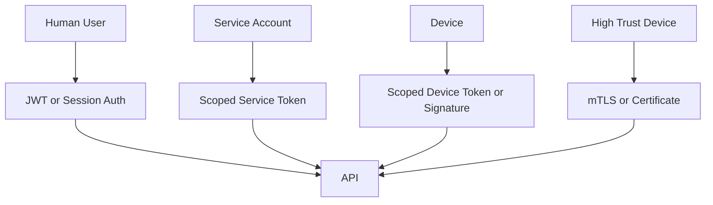

# Security Model

Security is based on actor identity, scoped permission, and auditable writes.

## Actor Types

```ts
export enum ActorType {
  USER = 'USER',
  SERVICE = 'SERVICE',
  DEVICE = 'DEVICE',
  SYSTEM = 'SYSTEM',
}
```

## Permission Examples

```ts
export enum LedgerPermission {
  LEDGER_READ = 'LEDGER_READ',
  LEDGER_WRITE = 'LEDGER_WRITE',
  DEVICE_EVENT_WRITE = 'DEVICE_EVENT_WRITE',
  INVENTORY_SCAN_WRITE = 'INVENTORY_SCAN_WRITE',
  ORDER_STATUS_WRITE = 'ORDER_STATUS_WRITE',
  DONATION_PROOF_READ = 'DONATION_PROOF_READ',
  ADMIN_OVERRIDE_WRITE = 'ADMIN_OVERRIDE_WRITE',
}
```

## Least Privilege

- Barcode scanners can write scan events, not admin changes.
- Label printers can record print events, not read donation data.
- Public proof pages can read proof-safe records only.
- Service accounts should be scoped to one integration purpose.

## Authentication Plan



## Required Controls

- Request id and correlation id.
- Rate limiting.
- Tenant scoping.
- Permission guards.
- Validation pipes.
- Audit events for accepted, rejected, and failed writes.
- Revocation support for users, services, and devices.
