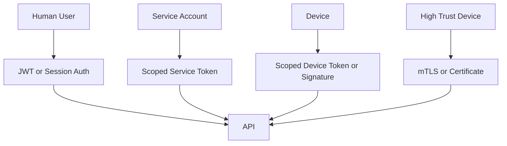

# Security Model

Security is based on actor identity, scoped permission, and auditable writes. This model ensures every API request and ledger event is authorized, tenant-scoped, and verifiable.

## Actor Types

```ts
export enum ActorType {
  USER = 'user',
  SERVICE = 'service',
  DEVICE = 'device',
  SYSTEM = 'system',
}
```

Human authorization is RBAC-based. Actor type identifies what is calling the API; roles and permissions identify what a human user can do. This separation ensures consistent authorization across web, tablet, mobile, public proof, and API surfaces. See [RBAC and Role-Specific Views](rbac-and-views.md) for the initial role and view matrix.

## Permission Examples

```ts
export enum LedgerPermission {
  LEDGER_READ = 'ledger.read',
  LEDGER_WRITE = 'ledger.write',
  LEDGER_AUDIT = 'ledger.audit',
  DEVICE_EVENT_WRITE = 'device.events.write',
  INVENTORY_SCAN_WRITE = 'inventory.scan.write',
  ORDER_STATUS_WRITE = 'orders.status.write',
  PROOF_READ = 'proof.read',
  ADMIN_OVERRIDE_WRITE = 'admin.override.write',
}
```

## Least Privilege

- Barcode scanners can write scan events, not admin changes.
- Label printers can record print events, not read donation data.
- Public proof pages can read proof-safe records only.
- Service accounts should be scoped to one integration purpose.

## Authentication Plan



## Authentication Architecture (Sprint 1)

Current authentication flow:

1. User login calls `/api/v1/auth/login` with username/password.
2. API validates credentials and returns access/refresh JWTs.
3. Frontend includes access token in protected API requests.
4. API validates token claims and resolves effective permissions.
5. Guards enforce tenant context and required permissions.
6. Relevant auth and denial events are appended to the ledger.

Service authentication flow:

1. Admin creates a scoped service token.
2. API stores only hashed token values.
3. Service calls protected endpoints with bearer token.
4. API resolves service actor permissions and tenant scope.

See [Auth API Reference](auth-api-reference.md) and [Service Token Management](service-token-management.md).

## JWT Token Structure Reference

### Access Token Claims

```json
{
  "sub": "admin",
  "actorType": "user",
  "tenantId": "00000000-0000-0000-0000-000000000000",
  "username": "admin",
  "roles": ["admin"],
  "permissions": ["ledger.read", "roles.manage"],
  "tokenType": "access",
  "jti": "f8526b42-6b57-4a84-80d2-40f9b35b8d7f",
  "iat": 1717600000,
  "exp": 1717603600
}
```

### Refresh Token Claims

```json
{
  "sub": "admin",
  "actorType": "user",
  "tenantId": "00000000-0000-0000-0000-000000000000",
  "username": "admin",
  "tokenType": "refresh",
  "jti": "a22bcba0-1656-4976-8f88-99e82d4f3a7b",
  "iat": 1717600000,
  "exp": 1717686400
}
```

Notes:

- `tokenType` distinguishes access vs refresh handling.
- `jti` supports refresh token revocation and rotation.
- `tenantId` is required for tenant-scoped authorization decisions.

## Secret and Credential Handling

Transport encryption is required. Web, tablet, mobile, service, and device clients must call the API over HTTPS in deployed environments. Browser-side encryption before sending credentials is not a replacement for TLS; if JavaScript can encrypt a value, injected JavaScript can usually access the same value or encryption material. Pre-API encryption should be reserved for explicit field-level encryption designs where the server intentionally should not read a stored value.

Credential rules for Sprint 1:

- Login credentials are sent only over HTTPS.
- Passwords are verified by the API and stored only as salted password hashes.
- The initial product login/logout/refresh flow must continue moving away from browser-readable token assumptions where production constraints allow it.
- JWT signing keys, database passwords, service-token peppers, and device-token signing keys come from environment variables or a secret manager, never committed files.
- Service and device tokens are stored hashed at rest. Raw tokens are shown once at creation and cannot be recovered.
- Access tokens should be short lived. Refresh tokens, if used, must be rotated and revocable.
- Production browser session storage must be decided explicitly. Prefer HttpOnly, Secure, SameSite cookies unless API/client constraints justify a different model.
- Sprint 1 decision: web clients use bearer JWTs with Web Storage because the API currently exchanges access/refresh tokens in JSON bodies for web, tablet, and scripted integration clients. Session storage is the default; users must explicitly opt in to persistent local storage via Remember Me.
- Sensitive at-rest business fields that need confidentiality beyond database access controls should use field-level encryption with managed keys.

## Required Controls

- Request id and correlation id.
- Rate limiting.
- Tenant scoping.
- Permission guards.
- Validation pipes.
- HTTPS-only production transport.
- Password and token hashing at rest.
- Secret rotation and revocation runbooks.
- Audit events for accepted, rejected, and failed writes.
- Revocation support for users, services, and devices.
- Route and navigation gating for web, tablet, and mobile clients.
