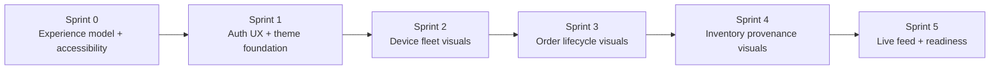
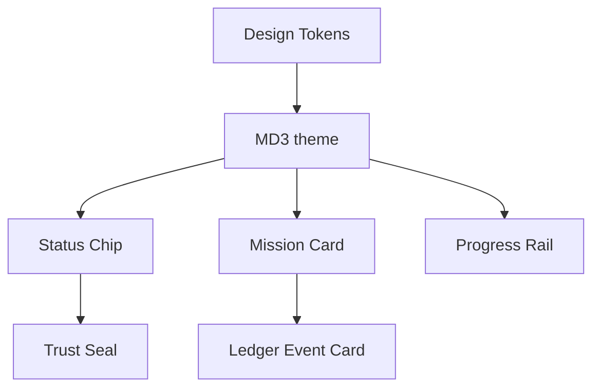
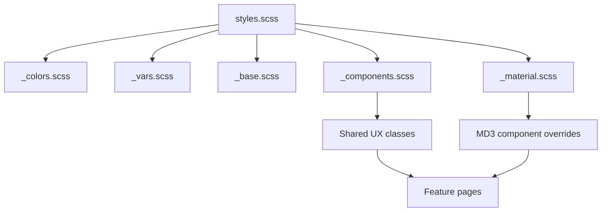
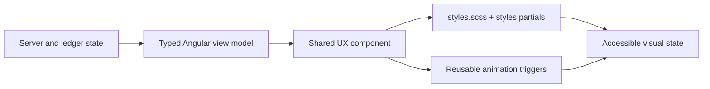

# PI-1 Gamification & Visual Appeal Addendum

This addendum defines how True North Ledger becomes a secure command center with a polished, trust-first experience. It is not a separate product layer; it is the UX foundation that makes verification, audit, and operations feel clear, compelling, and easy to use.

## Guiding Principles

- Trust-first: visual embellishments must reflect real audit state and ledger truth.
- Clarity over sparkle: every icon, badge, and animation should reduce cognitive load.
- Reward accuracy: gamification should reward complete, auditable behavior, not speed for its own sake.
- Accessibility everywhere: support reduced motion, high contrast, and non-color indicators.
- Progressive polish: start with theme/foundation, then add dashboard and workflow visuals in later sprints.

## PI-1 Visual Roadmap

### Sprint placement

- Sprint 0: define experience model, severity/status vocabulary, accessibility guardrails, and visual system principles.
- Sprint 1: build the MD3 theme foundation, auth shell polish, secure session indicators, and mission-based onboarding.
- Sprint 2: turn device management into a fleet command board with device status icons, heartbeat sparklines, and health seals.
- Sprint 3: add order lifecycle milestone visuals, order completeness rails, and verified proof indicators.
- Sprint 4: build inventory provenance timelines, scan success/failure feedback, and anomaly cards.
- Sprint 5: add live operations polish with real-time event feed, connection state indicator, system readiness score, and demo mode.

### Planning traceability status

| Sprint | Addendum intent | Planning status | Notes |
| --- | --- | --- | --- |
| Sprint 0 | Experience model, severity/status vocabulary, accessibility guardrails, visual system principles | Complete | Captured in this addendum, `documentation/development/frontend-ux-system.md`, architecture docs, coding standards, and current-state docs. Sprint 0 remediation itself is complete; visual planning was added as a PI-1 addendum after the security baseline. |
| Sprint 1 | MD3 theme foundation, auth shell polish, secure session indicators, mission onboarding | Complete | Secure session shell, permission-aware nav, MD3/theme primitives, Material Icons registry, reusable components, route animations, reduced-motion/high-contrast rules, and mission onboarding are implemented and covered by Sprint 1 checks. |
| Sprint 2 | Device fleet command board, status icons, heartbeat sparklines, health/reliability seals | Complete | Device fleet visual states, heartbeat/registration/revocation states, shared chips/seals, empty/error states, and responsive Playwright coverage are implemented and tracked in Sprint 2 and Sprint 4.5 verification. |
| Sprint 3 | Order lifecycle milestone visuals, completeness rails, verified proof indicators | Complete | Order lifecycle/completeness rails, proof hash and trust states, shared timeline/event primitives, reduced-motion support, and responsive Playwright coverage are implemented and tracked in Sprint 3 and Sprint 4.5 verification. |
| Sprint 4 | Inventory provenance timelines, scan feedback, anomaly cards | Complete | Inventory provenance/location timelines, accepted/rejected scan feedback, anomaly and alert cards, health visuals, operation-state cleanup, and responsive Playwright coverage are implemented and tracked in Sprint 4 and Sprint 4.5 verification. |
| Sprint 5 | Live feed, connection state, readiness score, demo mode | Planned | Tracked in Sprint 5 notification/live operations UI, visual E2E, and production/demo documentation tasks. |

### Sprint 0 completion note

The Sprint 0 security and quality remediation items are complete in `planning/SPRINT-0-REMEDIATION.md`. The Sprint 0 visual-planning intent from this addendum is also complete at the documentation level:

- [x] Define trust-first experience model.
- [x] Define severity/status vocabulary direction.
- [x] Define accessibility guardrails for non-color state, reduced motion, and high contrast.
- [x] Define visual system principles and shared style/component budget.
- [x] Document that gamification must derive from API, permission, or ledger state.

Sprint 0 did not implement reusable visual components. That implementation belongs to Sprint 1 and later sprint feature work.

## Core Visual & Gamification Themes

- **Secure session indicators**: a persistent auth state chip, device/actor badge, and permission-aware nav.
- **Status chips**: audit, device, order, inventory, and proof states should use consistent color/icon tokens.
- **Mission cards**: surface small, meaningful tasks such as "Verify your first ledger event" or "Create a service token".
- **Progress rails**: show completion state for onboarding, order processing, or audit review.
- **Proof badges**: display verified state and ledger confirmation on order/inventory records.
- **Event highlight**: signal live updates and ledger confirmations without overwhelming the user.

## Recommended Angular UX Stack

- Angular Material 3 for theming and accessible inputs
- Material Icons for status, audit, device, order, proof, and connectivity states
- Angular animations for route transitions and card motion
- Shared SCSS tokens and design variables in `apps/ledger-web/src/styles/`
- Reduced-motion and high-contrast overrides in the global theme

### Styles Budget Strategy

- Keep `apps/ledger-web/src/styles.scss` as the only global style entrypoint.
- Place reusable partials in `apps/ledger-web/src/styles/` and import them from `styles.scss`.
- Use the existing partial split: `_colors.scss`, `_vars.scss`, `_base.scss`, `_components.scss`, `_material.scss`, and `_mixins.scss`.
- Put MD3 and Angular Material overrides in `_material.scss`, not page-level component styles.
- Put reusable app UI classes such as chips, trust seals, mission cards, progress rails, empty states, and event cards in `_components.scss`.
- Put shared surface/button/layout helpers in `_mixins.scss`.
- Prefer shared component classes over per-feature overrides to reduce CSS bundle growth and implementation budget.
- Reuse Material density, typography, color, focus, menu, dialog, snackbar, and tooltip behavior before creating custom one-off styles.
- Add reduced-motion rules once in the shared styles layer, then make animation triggers opt into that behavior.

### Shared Component Budget

Build visual features as reusable Angular components before adding feature-specific templates:

- `StatusChipComponent`: canonical state label, icon, severity, and non-color status text.
- `SeverityChipComponent`: info, success, warning, error, and critical variants.
- `TrustSealComponent`: server-derived verification and proof state only.
- `MissionCardComponent`: onboarding or workflow completion task, backed by real server state.
- `ProgressRailComponent`: lifecycle steps for auth setup, device registration, orders, inventory, and PI demo readiness.
- `LedgerEventCardComponent`: consistent ledger event summary with actor, subject, result, hash, and timestamp.
- `ProofHashCardComponent`: proof hash, verification result, copy/download actions, and failure state.
- `ConnectionStatusComponent`: WebSocket and API reachability state.
- `TimelineRailComponent`: chronological events for order and inventory provenance.
- `EmptyStateComponent`: reusable empty/loading/error state with icon, action, and accessible text.

### Shared Animation Budget

Centralize animation triggers in a frontend utility module and reuse them across routes/pages:

- `routeFadeSlide`: app-route transitions.
- `cardEnter`: dashboard cards, mission cards, and list items.
- `eventHighlight`: newly appended ledger events.
- `statusPulse`: online/offline and connection state, disabled under reduced motion.
- `expandCollapse`: details, filters, and proof JSON panels.
- `proofVerified`: proof success confirmation.
- `scanAccepted` and `scanRejected`: inventory/device scan feedback.
- `connectionStateChange`: WebSocket connect, reconnect, and disconnect transitions.

## Gamification Guidance

- Reward verified and audited actions rather than raw speed.
- Show completion state for user tasks, but do not obscure audit status with meaningless points.
- Use soft badges and trust seals for actions such as:
  - verified login/auth session
  - successful service token creation
  - device heartbeat received
  - order proof generated
  - inventory scan verified
- Avoid leaderboard-style metrics until there is a full user/role model and explicit operational goals.

## Testing & E2E Coverage

As visual and gamification work is added, update the E2E plan to include:

- auth shell and secure session badge display
- permissions-aware nav visibility
- device card status visual states
- order milestone progress visualization
- provenance timeline rendering
- live event feed connectivity indicator
- reduced-motion and accessible UI states
- shared Material/MD3 components render consistently in light, focus, disabled, success, warning, and error states
- icon-only buttons have accessible names
- no visual state relies on color alone
- no horizontal overflow or text clipping in dashboard cards, chips, rails, or timelines

### Quality Gate Additions

- Unit-test shared components with representative state variants before reusing them in sprint pages.
- Add Playwright checks for each new visual primitive the first time it appears in a sprint.
- Keep screenshots or DOM assertions focused on business states, not animation timing.
- Run the normal baseline before marking visual work done: `pnpm nx run-many -t lint test build` and `pnpm nx e2e ledger-web-e2e`.

## Sprint 4.5 Adherence Review

The Sprint 4.5 hardening work continues to follow the addendum:

- Shared MD3 styles are centralized under `apps/ledger-web/src/styles/` and imported through `styles.scss`.
- Inventory and order page styling was moved out of large page SCSS files into `_components.scss`, reducing component style-budget pressure.
- Inventory operation polish uses server/API operation state (`operatingItemId`, loading flags, API responses) rather than client-only rewards or hardcoded success states.
- Status, severity, trust, progress, connection, timeline, event, proof, and empty-state visuals retain text labels or accessible names so state does not rely on color alone.
- Reduced-motion and responsive Playwright coverage exists for the visual states introduced through Sprint 4.5.
- New visual assertions remain tied to workflow state: permission visibility, failed-network states, operation pending states, scan outcomes, proof failures, anomaly status, and provenance history.

## Implementation priorities

1. Sprint 1: theme foundation, auth shell, secure session visual state, mission onboarding.
2. Sprint 2: device fleet board, heartbeat/status icons, device status card.
3. Sprint 3: order lifecycle rail, milestone badges, proof state indicator.
4. Sprint 4: provenance timeline, anomaly cards, scan feedback.
5. Sprint 5: live feed, connection heartbeat, readiness score, demo/command center view.
