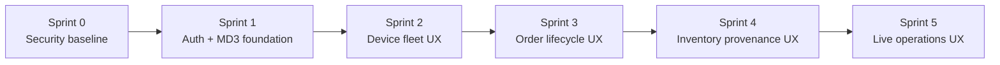

# Program Increment 1 - Core Platform Foundation

**Duration:** 10 weeks (5 x 2-week sprints)  
**Start Date:** 2026-06-03  
**End Date:** 2026-08-11  
**Focus:** Authentication, Device Management, Orders & Inventory Core

## PI Objectives

Build the foundational platform capabilities that enable secure multi-actor operations (users, services, devices, system) with full auditability and proof generation.

### PI-Level Acceptance Criteria

- [ ] All actor types (`user`, `service`, `device`, `system`) can authenticate and receive scoped permissions
- [ ] RBAC roles govern API permissions and web/tablet/mobile route visibility
- [ ] Devices can register, authenticate, and submit events with proper identity
- [ ] Orders can be created, updated, and tracked with full ledger audit trail
- [ ] Inventory operations create verifiable ledger events
- [ ] All write operations generate ledger events with proper hash chaining
- [ ] WebSocket notifications deliver real-time updates to connected clients
- [ ] Public proof pages verify events without exposing private data
- [ ] E2E tests validate critical workflows across frontend and API
- [ ] Shared MD3 styles, Material Icons, reusable UX components, and animation primitives are used for all new visual work
- [ ] E2E tests validate visual states, reduced-motion behavior, and permission-aware navigation for new UI elements
- [ ] Production-ready Docker Compose infrastructure deployed with monitoring
- [ ] API documentation (OpenAPI/Swagger) published and accessible

### PI Success Metrics

- 90%+ test coverage across all modules
- < 200ms p95 API response time for read operations
- < 500ms p95 API response time for write operations
- Zero critical security vulnerabilities
- All ledger events include complete audit metadata
- 100% of write operations create auditable ledger events
- New UI polish reuses shared `styles.scss`, `styles/` partials, and shared Angular components instead of page-specific CSS duplication

---

## Sprint 1: Authentication & Authorization Foundation (Weeks 1-2)

**Goal:** Implement secure multi-actor authentication with scoped permissions and audit events.

### Sprint Acceptance Criteria

- [x] JWT-based authentication working for `user` actors
- [x] Service token authentication implemented
- [x] Permission guard system operational across all endpoints
- [x] Auth-related ledger events captured (login, logout, permission denied)
- [x] Rate limiting active on all public endpoints
- [x] Integration tests validate auth flows and permission enforcement
- [x] Secure auth UX and role-aware navigation are implemented in the web shell

### Visual & Experience Work

- [x] Establish Angular Material 3 theme tokens and shared SCSS design system
- [x] Add Material Icons registry and UX iconography for audit, device, order, proof, and status states
- [x] Add route transition animation foundation and reduced-motion accessibility support
- [x] Define gamification principles that reward accuracy, completeness, and verified audit behavior
- [x] Create shared UX primitives for status chips, severity chips, trust seals, mission cards, progress rails, event cards, proof hash cards, connection status, empty states, and timelines
- [x] Keep reusable MD3 overrides in `apps/ledger-web/src/styles/_material.scss` and reusable app styles in `apps/ledger-web/src/styles/_components.scss`
- [x] Add E2E coverage for auth UX, secure nav, and permission-based route visibility

### Sprint 1 Delivery Status

- Sprint 1 execution details and completion tracking are maintained in `planning/SPRINT-1-TASKS.md`.
- Documentation deliverables completed in Sprint 1 now include:
  - `documentation/development/getting-started-authentication.md`
  - `documentation/development/frontend-login-flow.md`
  - `documentation/platform/auth-api-reference.md`
  - `documentation/platform/service-token-management.md`
  - `documentation/platform/service-token-integration-guide.md`

---

## Sprint 2: Device Management & Identity (Weeks 3-4)

**Goal:** Enable device registration, authentication, and event ingestion with proper identity and audit trails.

### Sprint Acceptance Criteria

- [x] Devices can register with unique identity and receive scoped API keys
- [x] Device authentication validates device API keys
- [x] Device heartbeat endpoint tracks online/offline status
- [x] Device events create ledger entries with device actor context
- [x] Device revocation immediately blocks access
- [x] Nonce validation prevents replay attacks
- [x] Device status visible in admin UI
- [x] Device fleet visual states, heartbeat indicators, and reliability seals use shared visual primitives

### Tasks

#### Backend Device System
- [x] Create `devices` module in ledger-api
- [x] Create `Device` entity with TypeORM
- [x] Implement device registration endpoint (`POST /api/v1/devices/register`)
- [x] Build device token generation with scoped API keys
- [x] Create `DeviceAuthGuard` for device endpoints
- [x] Implement heartbeat endpoint (`POST /api/v1/devices/heartbeat`)
- [x] Add device status endpoint (`GET /api/v1/devices/:id/status`)
- [x] Create device event ingestion endpoint (`POST /api/v1/device-events`)
- [x] Implement batch device event endpoint (`POST /api/v1/device-events/batch`)
- [x] Add database-backed nonce tracking for replay protection with expiration cleanup
- [x] Build device revocation logic with immediate token invalidation
- [x] Create device-related ledger event types for registration, heartbeat, revocation, status, and event ingestion
- [x] Write behavior-focused unit tests for device service
- [x] Write integration tests for device registration and auth
- [x] Add OpenAPI documentation for device endpoints

#### Contract Updates
- [x] Create device registration schema in device-contracts
- [x] Add device event batch schema
- [x] Define device status enums and schemas
- [x] Add device authentication request/response schemas

#### Frontend Device Management
- [x] Create `DeviceService` in ledger-web
- [x] Build device registry page (`/devices`)
- [x] Add device registration form
- [x] Display device list with status indicators
- [x] Show device heartbeat timestamps
- [x] Implement device revocation UI
- [x] Add device event stream view
- [x] Write unit tests for device service

#### Visual & Experience Work
- [x] Add device fleet command board using shared MD3 surfaces
- [x] Use shared status chip, severity chip, trust seal, mission card, and empty state components
- [x] Add device type iconography with accessible labels or adjacent text
- [x] Add heartbeat sparkline or compact recency visual with timestamp text
- [x] Add reliability seal derived from server heartbeat and revocation state
- [x] Add unit tests for online, offline, suspended, revoked, empty, loading, and error visual states

#### Testing & Documentation
- [x] E2E tests: device registration flow
- [x] E2E tests: device authentication and event submission
- [x] E2E tests: revoked devices cannot submit events
- [x] E2E tests: batch device events processed correctly
- [x] E2E tests: nonce replay protection works
- [x] E2E tests: device fleet board visual states and heartbeat indicators do not rely on color alone
- [x] Document device registration flow
- [x] Create device integration guide for hardware partners

### Sprint 2 Delivery Status

- Sprint 2 execution details and completion tracking are maintained in `planning/SPRINT-2-TASKS.md`.
- Documentation deliverables completed in Sprint 2 now include:
  - `documentation/platform/device-management.md`
  - `documentation/platform/device-event-ingestion-guide.md`
- Remaining Sprint 2 closeout items are code review approval and development-environment deployment testing.

---

## Sprint 3: Orders Module & Ledger Integration (Weeks 5-6)

**Goal:** Implement order lifecycle management with full ledger audit trail and proof generation.

### Sprint Acceptance Criteria

- [x] Orders can be created with proper validation
- [x] Order status changes create ledger events
- [x] Order history fully auditable via ledger
- [x] Order proofs generated for verification
- [x] Correlation IDs link related order events
- [x] Order list and detail views functional in UI
- [x] Integration tests validate order workflows
- [x] Order lifecycle rail, milestone badges, and proof indicators derive from order and ledger state

### Tasks

#### Backend Orders System
- [x] Create `orders` module in ledger-api
- [x] Create `Order` entity with TypeORM (id, tenant_id, status, customer_id, items, created_at, updated_at)
- [x] Implement create order endpoint (`POST /api/v1/orders`)
- [x] Add update order status endpoint (`PATCH /api/v1/orders/:id/status`)
- [x] Build order retrieval endpoints (`GET /api/v1/orders`, `GET /api/v1/orders/:id`)
- [x] Create order cancellation endpoint (`POST /api/v1/orders/:id/cancel`)
- [x] Implement order ledger event types (ORDER_CREATED, ORDER_STATUS_CHANGED, ORDER_CANCELLED)
- [x] Add correlation ID tracking for related order events
- [x] Build order proof generation logic
- [x] Create order search with filtering (status, date range, customer)
- [x] Write behavior-focused unit tests for order service
- [x] Write integration tests for order lifecycle
- [x] Add OpenAPI documentation for order endpoints

#### Contract Updates
- [x] Create order schemas in shared-models/order-contracts (CreateOrderRequest, OrderStatusUpdateRequest, OrderResponse)
- [x] Add order status enum
- [x] Define order item schemas
- [x] Add order proof schema

#### Frontend Orders Management
- [x] Create `OrderService` in ledger-web
- [x] Build orders list page (`/orders`)
- [x] Create order detail page (`/orders/:id`)
- [x] Add order creation form
- [x] Display order status timeline
- [x] Show related ledger events for each order
- [x] Implement order search and filters
- [x] Add order proof view/download
- [x] Write unit tests for order service

#### Visual & Experience Work
- [x] Add order lifecycle rail and milestone badges
- [x] Add order completeness rail for customer, items, address, review, and proof readiness
- [x] Reuse shared timeline rail, status chip, trust seal, event card, and proof hash card components
- [x] Add proof verified, failed, and pending visual states with non-color labels
- [x] Add reduced-motion fallback for order timeline and proof confirmation animations
- [x] Add unit tests for lifecycle, proof, empty, loading, and error visual states

#### Testing & Documentation
- [x] E2E tests: create order workflow
- [x] E2E tests: order status updates create ledger events
- [x] E2E tests: order cancellation workflow
- [x] E2E tests: order proof generation and verification
- [x] E2E tests: order search and filtering
- [x] E2E tests: order lifecycle rail, milestone badges, and proof indicators are accessible and responsive
- [x] Document order API workflows
- [x] Create order integration guide for partners

### Current Sprint 3 Delivery Update (2026-06-12)

- Completed the backend orders lifecycle, contracts, Angular list/create/detail/proof experience, shared visual primitives, and order workflow test coverage.
- Added catalog-backed SKU autocomplete to the multi-step order form with custom SKU support.
- Extracted the four-step creation workflow into a dedicated `OrderCreateComponent` with focused unit coverage and updated Playwright metadata-error recovery coverage.
- Added resettable order search filters with Angular unit and cross-browser Playwright coverage.
- Completed the order API workflow, quick-start, partner integration, payload, proof verification, search, UI state, testing, environment, and troubleshooting documentation.
- Resolved a local full-stack port conflict by moving the external `phase-2-cosmic` Grafana host mapping from `3000` to `3005`, preserving `3000` for the ledger API.
- Stabilized full-suite Playwright execution by using the public API readiness endpoint, isolating route-permission coverage from live order authentication, and tightening the unauthorized-page assertion.
- Completed authenticated tenant-scoped real-time order updates and shared Angular order state propagation, including live full-stack Playwright coverage.
- Current full gates: all unit targets passed (`shared-models` 14 tests, `ledger-web` 153 tests, `ledger-api` 189 tests), `ledger-web-e2e` lint passed, and the full development-stack Playwright target passed 484 tests with 16 intentionally skipped across 500 discovered tests.
- Sprint 3 code review, critical/high bug review, development-environment testing, demo-readiness, order state management, and real-time update gates are complete.

---

## Sprint 4: Inventory Module & Provenance (Weeks 7-8)

**Goal:** Build inventory tracking with provenance verification and device scan integration.

### Sprint Acceptance Criteria

- [ ] Inventory items tracked with unique identifiers
- [ ] Inventory operations (add, reserve, move, remove) create ledger events
- [ ] Device scans update inventory with actor attribution
- [ ] Inventory provenance traceable through ledger
- [ ] Inventory alerts for low stock/anomalies
- [ ] Inventory dashboard shows real-time status
- [ ] Integration with device events for automated tracking
- [ ] Inventory provenance timeline, scan feedback, anomaly cards, and inventory health visuals use shared visual primitives

### Tasks

#### Backend Inventory System
- [ ] Create `inventory` module in ledger-api
- [ ] Create `InventoryItem` entity with TypeORM (id, sku, location, quantity, status, metadata)
- [ ] Implement add inventory endpoint (`POST /api/v1/inventory`)
- [ ] Create reserve inventory endpoint (`PATCH /api/v1/inventory/:id/reserve`)
- [ ] Build move inventory endpoint (`PATCH /api/v1/inventory/:id/move`)
- [ ] Add remove inventory endpoint (`DELETE /api/v1/inventory/:id`)
- [ ] Implement inventory scan endpoint (`POST /api/v1/inventory/scan`)
- [ ] Create inventory ledger event types (INVENTORY_ADDED, INVENTORY_RESERVED, INVENTORY_MOVED, INVENTORY_REMOVED, INVENTORY_SCANNED)
- [ ] Build provenance query endpoint (trace item history)
- [ ] Implement inventory anomaly detection (unexpected moves, missing items)
- [ ] Add inventory search with filters (location, SKU, status)
- [ ] Write behavior-focused unit tests for inventory service
- [ ] Write integration tests for inventory operations
- [ ] Add OpenAPI documentation for inventory endpoints

#### Contract Updates
- [ ] Create inventory schemas (InventoryItemDto, ReserveInventoryDto, MoveInventoryDto)
- [ ] Add inventory status enum
- [ ] Define scan event schema
- [ ] Add provenance response schema

#### Frontend Inventory Management
- [ ] Create `InventoryService` in ledger-web
- [ ] Build inventory list page (`/inventory`)
- [ ] Create inventory detail page with provenance timeline
- [ ] Add inventory operation forms (add, reserve, move)
- [ ] Display inventory scan events from devices
- [ ] Show inventory alerts and anomalies
- [ ] Implement inventory search and filters
- [ ] Add provenance visualization
- [ ] Write unit tests for inventory service

#### Visual & Experience Work
- [ ] Add provenance timeline with actor, movement, location, quantity, and anomaly labels
- [ ] Add scan accepted/rejected feedback with reduced-motion fallback
- [ ] Add anomaly cards using shared severity chip and status chip styles
- [ ] Add inventory health visuals for low stock, expiring soon, damaged, reserved, and removed states
- [ ] Reuse shared timeline rail, ledger event card, trust seal, status chip, severity chip, and empty state components
- [ ] Add unit tests for provenance, scan, anomaly, empty, loading, and error visual states

#### Testing & Documentation
- [ ] E2E tests: add inventory workflow
- [ ] E2E tests: reserve/move inventory operations
- [ ] E2E tests: device scan updates inventory
- [ ] E2E tests: provenance trace shows complete history
- [ ] E2E tests: inventory anomalies detected
- [ ] E2E tests: provenance timeline, scan feedback, and anomaly cards remain readable without motion or color-only cues
- [ ] Document inventory tracking workflows
- [ ] Create inventory integration guide

---

## Sprint 5: WebSocket Notifications & Production Infrastructure (Weeks 9-10)

**Goal:** Enable real-time updates via WebSockets and deploy production-ready infrastructure with monitoring.

### Sprint Acceptance Criteria

- [ ] WebSocket server operational with authentication
- [ ] Real-time notifications delivered to connected clients
- [ ] Clients can subscribe to specific event types/subjects
- [ ] WebSocket connections gracefully handle reconnection
- [ ] Nginx reverse proxy configured for all services
- [ ] Prometheus + Grafana monitoring operational
- [ ] Production environment variables configured
- [ ] Health check endpoints implemented
- [ ] Production Docker Compose stack deployed
- [ ] Live operations UI shows connection state, event highlights, readiness score, and demo mode using shared visual primitives

### Tasks

#### Backend WebSocket Implementation
- [ ] Add `@nestjs/websockets` and `socket.io` dependencies
- [ ] Create `notifications` module in ledger-api
- [ ] Implement WebSocket gateway with authentication
- [ ] Build subscription system (by event type, subject, tenant)
- [ ] Emit notifications on ledger event creation
- [ ] Add WebSocket connection management
- [ ] Implement room-based event broadcasting
- [ ] Create heartbeat/ping-pong for connection health
- [ ] Write unit tests for notification gateway
- [ ] Write integration tests for WebSocket events

#### Frontend WebSocket Integration
- [ ] Create `NotificationService` in ledger-web
- [ ] Implement Socket.IO client connection
- [ ] Add authentication to WebSocket handshake
- [ ] Build event subscription management
- [ ] Create notification UI component
- [ ] Display real-time ledger events in dashboard
- [ ] Add connection status indicator
- [ ] Implement reconnection logic
- [ ] Write unit tests for notification service

#### Visual & Experience Work
- [ ] Add connection status component states for connected, connecting, reconnecting, disconnected, and failed
- [ ] Add live event feed highlights using reduced-motion-aware animation
- [ ] Add live operations board with system readiness score, active connections, recent verified events, open anomalies, and heartbeat health
- [ ] Add PI demo mode seeded by real API state or approved fixtures, never hardcoded success states
- [ ] Reuse shared connection status, ledger event card, status chip, severity chip, progress rail, and empty state components
- [ ] Add unit tests for connection, event-feed, readiness, demo, empty, loading, and error visual states

#### Infrastructure & Monitoring
- [ ] Create production docker-compose.yml
- [ ] Add Nginx service with reverse proxy configuration
- [ ] Configure Nginx SSL/TLS (self-signed for dev)
- [ ] Add Prometheus service for metrics collection
- [ ] Configure Grafana with default dashboards
- [ ] Implement health check endpoints (`/api/health`, `/api/ready`)
- [ ] Add Prometheus metrics to NestJS app
- [ ] Create dashboard for API metrics (requests, latency, errors)
- [ ] Add database connection pool monitoring
- [ ] Configure log aggregation (basic stdout/stderr)
- [ ] Document production deployment process
- [ ] Create environment variable reference guide

#### OpenAPI & Documentation
- [ ] Generate OpenAPI/Swagger documentation
- [ ] Add Swagger UI endpoint (`/api/docs`)
- [ ] Document all endpoints with examples
- [ ] Add authentication documentation to Swagger
- [ ] Create API versioning strategy
- [ ] Publish API changelog

#### Testing & Documentation
- [ ] E2E tests: WebSocket connection and authentication
- [ ] E2E tests: real-time notifications delivered correctly
- [ ] E2E tests: subscription filtering works
- [ ] E2E tests: reconnection after disconnect
- [ ] E2E tests: live feed, connection status, readiness score, and demo mode derive from API/WebSocket/ledger state
- [ ] Load tests: API under concurrent users
- [ ] Load tests: WebSocket concurrent connections
- [ ] Document WebSocket integration guide
- [ ] Create production deployment runbook
- [ ] Update README with production setup

---

## PI Risks & Dependencies

### High Risks
- **Performance:** WebSocket scalability with high device connection counts (mitigation: load test early, plan Redis adapter)
- **Security:** Device token management complexity (mitigation: clear revocation strategy, audit all auth events)
- **Data Integrity:** Ledger hash chain consistency under concurrent writes (mitigation: database transaction isolation, integration tests)

### Medium Risks
- **Technical Debt:** Contract library synchronization between frontend/backend (mitigation: automated validation tests)
- **Scope Creep:** Additional actor types or permission models (mitigation: defer to PI-2)
- **Infrastructure:** Production deployment complexity (mitigation: comprehensive documentation, rehearsal in staging)

### Dependencies
- PostgreSQL 16+ for JSONB and performance
- Redis 7+ for rate limiting, caching, and nonce tracking
- Docker Compose for local and production deployment
- Node.js 20+ LTS for runtime stability

### Assumptions
- Single-tenant per environment initially (multi-tenancy via tenant_id in data)
- REST-first, MQTT deferred to PI-2
- Self-signed certificates acceptable for initial production
- Basic monitoring sufficient (advanced APM in PI-2)

---

## PI Demo & Retrospective

### Demo Objectives (Week 10)
- Live demonstration of complete order workflow with device scan
- Show real-time dashboard updates via WebSocket
- Demonstrate device registration and event submission
- Prove ledger audit trail completeness
- Display public proof verification
- Showcase monitoring dashboards
- Showcase shared visual system reuse across auth, devices, orders, inventory, proofs, and live operations

### Retrospective Focus Areas
- Test coverage and quality gate effectiveness
- Contract library synchronization challenges
- WebSocket performance and stability
- Development velocity and estimation accuracy
- Technical debt accumulation
- Team collaboration and communication

---

## Post-PI Backlog Preview (PI-2 Candidates)

**Donations Module:**
- Donation tracking and disbursement
- Public donation proof pages
- QR code generation for proofs

**Anomaly Detection:**
- Fraud pattern detection
- Automated alerts for suspicious events
- ML-based anomaly scoring

**Advanced Device Features:**
- MQTT broker integration
- mTLS device authentication
- Certificate rotation
- Edge gateway support

**Mobile & Tablet Optimized UI:**
- Touch-first operation flows
- Mobile scan and approve workflows
- Offline-capable device apps

**Advanced Monitoring:**
- APM integration (New Relic/Datadog)
- Distributed tracing
- Advanced alerting rules
- SLA monitoring

**Performance Optimization:**
- Query optimization and indexing
- Redis caching layer
- Read replica support
- CDN for static assets
